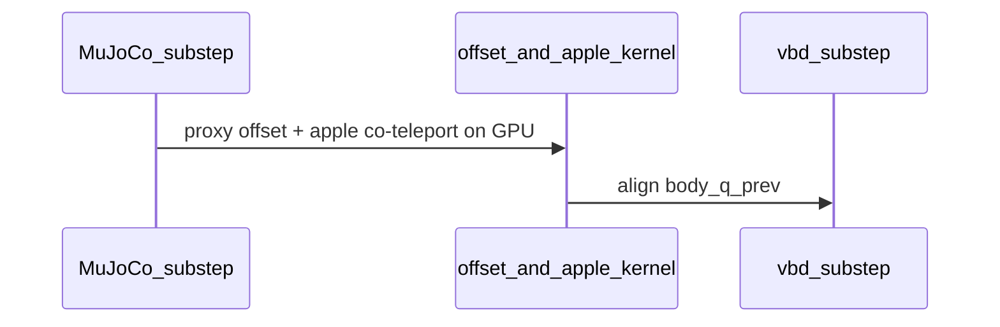

# Scene merge (Option B) + GPU co-teleport

## Current state

- `[scene.py](apple_pick_sim/coupled_fruiting/scene.py)` — `CoupledFruitingScene` (single cable, full teleop, `vbd_only`/`mujoco_only`)
- Mega apple alignment today: CPU `_co_teleport_apples_from_proxies` (`.numpy()` loop) runs **after** `launch_mirror_robot_to_proxy_offset`

```mermaid
sequenceDiagram
    participant MJ as MuJoCo_substep
    participant Off as offset_mirror_kernel
    participant CPU as co_teleport_CPU
    participant VBD as vbd_substep
    participant Harv as harvest

    MJ->>Off: ghost sync all proxies
    Off->>CPU: host sync if fix_to_apple
    CPU->>VBD: align body_q_prev
    VBD->>Harv: nominal column only
```


Target (combined kernel):




## Phase 1 — GPU kernel (TDD)

**Add failing unit test first** in `[test_proxy_coupling.py](apple_pick_sim/tests/test_proxy_coupling.py)`:

- `test_mirror_robot_tcp_to_proxy_offset_and_apple_kernel` — synthetic 1–2 row launch:
  - Mirror TCP to proxy with nonzero `position_offsets`
  - Derive apple as `X_apple = X_proxy * X_offset^{-1}` and twist via lever arm (same math as CPU helper in git HEAD `mega_scene.py`)
  - Assert parity against a small NumPy reference (reuse patterns from `[test_proxy_offset_math.py](apple_pick_sim/tests/test_proxy_offset_math.py)`)
  - Rows with `apple_body_id == -1` must not touch apple slots

**Implement in `[proxy_coupling.py](apple_pick_sim/coupled_fruiting/proxy_coupling.py)`:**

- New `@wp.kernel mirror_robot_tcp_to_proxy_offset_and_apple_kernel` — per thread `i`:
  1. Existing offset-proxy mirror logic from `[mirror_robot_tcp_to_proxy_offset_kernel](apple_pick_sim/coupled_fruiting/proxy_coupling.py)` (lines 127–161)
  2. If `apple_body_ids[i] >= 0`: co-teleport apple from **proxy pose/twist** (not TCP), matching CPU `_co_teleport_apples_from_proxies`
- New `launch_mirror_robot_to_proxy_offset_and_apple(...)` wrapper
- Helper to build per-instance Warp arrays (cached on scene at build time):

```python
def mega_welded_co_teleport_arrays_wp(
    mega: MegaCoupledCableScene, *, device: str
) -> tuple[wp.array, wp.array, wp.array]:
    # apple_body_ids[i] = inst.apple_body or -1
    # proxy_offset_in_apple[i] = wp.transform from 7-tuple or identity for skipped rows
```

Keep existing `launch_mirror_robot_to_proxy_offset` unchanged for non-welded mega paths and existing unit test `test_mirror_robot_tcp_to_proxy_offset_kernel`.

## Phase 2 — Consolidate files (Option B)

**Target layout:** single `[scene.py](apple_pick_sim/coupled_fruiting/scene.py)`, delete `mega_scene.py`.

### Shared module-level helpers (new, private)

Extract identical logic from both classes into functions at top of `scene.py`:


| Helper                                                                     | Used by both for                                                                        |
| -------------------------------------------------------------------------- | --------------------------------------------------------------------------------------- |
| `_vbd_substep(cable, pipeline, dt, after_clear=...)`                       | Identical `vbd_substep` body                                                            |
| `_mujoco_robot_substep_prefix(scene, dt)`                                  | `clear_forces`, kinematic FK vs dynamic `mj_solver.step`, wrench apply, contact collide |
| `_harvest_coupling_wrenches(scene, vbd_contacts, dt, *, harvest_registry)` | Stem vs velocity-delta branch + `force_debug`                                           |
| `_apply_fr3_ee_teleop(...)` / `_apply_fr3_ee_teleop_direct(...)`           | Teleop methods (preserve single-only `_update_mjc_data` in non-direct path)             |


Both dataclasses delegate to these; **class-specific sync paths stay separate methods**:

- `CoupledFruitingScene._sync_proxy_after_mujoco` — unchanged semantics:
  - `launch_mirror_robot_to_proxy_and_apple` or `launch_mirror_robot_to_proxy`
  - welded: `copy_cable_body_q_between_states` + `sync_solver_body_q_prev_from_state`
  - else: `align_proxy_body_q_prev_for_vbd(proxy_registry.proxy_body_ids)`
- `MegaCoupledFruitingScene._sync_proxy_after_mujoco` — updated:
  - If `fix_to_apple`: `launch_mirror_robot_to_proxy_offset_and_apple` (combined kernel)
  - Else: `launch_mirror_robot_to_proxy_offset`
  - `align_proxy_body_q_prev_for_vbd(all proxies + apple bodies when welded)` — **do not** add single-scene's `state_1` copy (FD tests depend on current mega alignment)

Move from deleted `mega_scene.py`:

- `MegaCoupledFruitingScene` dataclass + methods
- `mega_ghost_position_offsets_wp` (stays exported)
- Remove `_co_teleport_apples_from_proxies` entirely

Add optional field on `MegaCoupledFruitingScene`:

- `welded_co_teleport_arrays: tuple[wp.array, wp.array, wp.array] | None` — built in `build_mega_coupled_fruiting_fr3` when `gripper_proxy.fix_to_apple`

### Import / export updates

- `[__init__.py](apple_pick_sim/coupled_fruiting/__init__.py)`: import `MegaCoupledFruitingScene`, `mega_ghost_position_offsets_wp` from `scene`
- `[builders.py](apple_pick_sim/coupled_fruiting/builders.py)`: same; wire `welded_co_teleport_arrays` at build when `fix_to_apple`
- Update doc paths in `[docs/mega-coupled-cable-implementation.md](docs/mega-coupled-cable-implementation.md)` and `[docs/variable-impedance-teleop.md](docs/variable-impedance-teleop.md)` (`scene.py` only)

## Phase 3 — Documentation

Add short subsection to `[docs/mega-coupled-cable-implementation.md](docs/mega-coupled-cable-implementation.md)`:

- Combined kernel name/symbol
- Tests that prove it
- Note: no host sync on co-teleport substeps

## Validation (must all pass)

From repo root:

```bash
PYTHONPATH=$(pwd) uv run --directory newton python -m pytest \
  ../apple_pick_sim/tests/test_proxy_coupling.py::test_mirror_robot_tcp_to_proxy_offset_and_apple_kernel \
  ../apple_pick_sim/tests/test_proxy_coupling.py::test_mirror_robot_tcp_to_proxy_offset_kernel \
  ../apple_pick_sim/tests/test_mega_coupled_fruiting.py \
  ../apple_pick_sim/tests/test_mega_fd_kinematics.py \
  ../apple_pick_sim/tests/test_coupled_fruiting_system.py \
  -q -p no:launch_testing
```

Critical regressions to watch:

- `[test_mega_fix_to_apple_co_teleport_twist_matches_proxy](apple_pick_sim/tests/test_mega_coupled_fruiting.py)` — apple `body_qd` matches proxy after sync
- `[test_mega_instance0_parity_vs_1x1](apple_pick_sim/tests/test_mega_coupled_fruiting.py)` — nominal column matches single-instance scene
- `[test_mega_fd_kinematics.py](apple_pick_sim/tests/test_mega_fd_kinematics.py)` — FD Jacobian sign/column sensitivity

Smoke:

```bash
PYTHONPATH=$(pwd) uv run --directory newton python \
  ../apple_pick_sim/examples/example_mega_coupled_keyboard.py --viewer null --num-frames 1
```

## Out of scope (explicit)

- Option A unified class with `isinstance` branching
- Changing single-instance `CoupledFruitingScene` to use offset kernel (zero-offset unification)
- Adding `apply_fr3_ee_teleop` / `vbd_only` to mega (can follow later without merge risk)

