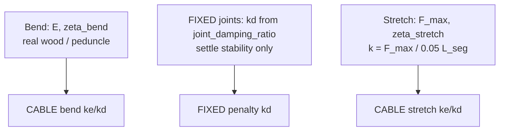

# Damping and stiffness layers: bend (real), joints (stability), stretch (max load)

## Document status

| Field | Value |
| ----- | ----- |
| **Last updated** | 2026-07-23 |
| **Roadmap slice** | [V].2.1.3 (material-parameter sampling) / settle stability |
| **Owner** | Abhinav |

## Summary — three independent knobs

Tune **bending** for physical realism, **FIXED-joint damping** for numerical settle
stability, and **axial stretch** from an expected max-load budget. Do not use one
layer to fix problems that belong to another.

| Layer | Where | What you set | What it means |
| ----- | ----- | ------------ | ------------- |
| **Bend (real values)** | `CABLE` bend | `youngs_modulus_pa` \(E\), bend `damping_ratio` \(\zeta\) | Literature / sys-ID wood–peduncle bending. \(k_{\mathrm{bend}}=EI/L_{\mathrm{seg}}\), \(c_{\mathrm{bend}}=2\zeta\sqrt{k_{\mathrm{bend}} J_{\mathrm{seg}}}\). This is the CEM / hardware-transfer knob. |
| **Joints (stability)** | `FIXED` welds | `sim_build.joint_damping_ratio` (or per-role `kd` / `kp`) | Damps discrete support / rod↔rod / stem→apple / proxy welds so VBD settles. **Not** wood viscosity. Support \(k_p\) is also a **sys-ID target** (batched Young's grid/CMA); during that path support \(k_d\) uses the **same** `joint_damping_ratio` recorded in the dataset (collect/replay parity) — see `docs/superpowers/specs/2026-08-04-support-joint-kp-sysid-design.md`. |
| **Stretch (max load)** | `CABLE` stretch | `vbd_stretch_force.max_force_n` \(F_{\max}\), `damping_ratio` \(\zeta_{\mathrm{stretch}}\) | Soft axial spring sized so extension at \(F_{\max}\) stays within \(\delta=0.05\,L_{\mathrm{seg}}\): \(k=F_{\max}/\delta\). Decoupled from bend \(E\). |

Canonical fixture: `apple_pick_sim/fixtures/fruiting_system_ranges_real_world_proxy_variance.json`
(\(E\) from wood/peduncle bands, bend \(\zeta=0.3\), \(F_{\max}=35\,\mathrm{N}\) ≈ stem break /
detach scale, joint \(\zeta\) in `sim_build`).



**Do not conflate:**

- Raising bend \(\zeta\) past a wood-plausible band will not fix weld jitter — use joint `kd`.
- Cranking stretch \(\zeta\) to kill axial ring adds \(k_d/\Delta t\) virtual stiffness and can make AVBD worse when \(\omega_n\cdot\Delta t\) is already large — prefer smaller \(k\) (larger \(\delta\) or lower \(F_{\max}\)) or smaller \(\Delta t\).
- Soft stretch is **not** a hard "no extension until \(F_{\max}\)" switch; it is a linear spring with \(\delta(F)\approx F/k\). \(F_{\max}\) is the design load for the extension budget (e.g. force at which the apple would detach), not a yield threshold inside the solver.

## 1. Cable bend — real material values (`youngs_modulus_pa`, `damping_ratio`)

Set per rod segment (`primary`, `spur`, `stem`) in the range JSON. Consumed by
`apple_pick_sim/fruiting_system/params.py::rod_params_from_material`:

\[
k_{\text{bend}} = E I / L_{\text{seg}},\qquad
c_{\text{bend}} = 2\zeta\sqrt{k_{\text{bend}} \cdot J_{\text{seg}}}
\]

(see `docs/material-parameter-sampling.md`). Written into `RodParams.bend_stiffness` /
`bend_damping` → `builder.add_rod(...)` → `model.joint_target_ke/kd` on `CABLE` bend.

**Current fixture** uses bend `damping_ratio: 0.3` (wood-like) and \(E\) bands from
wood/peduncle literature / proxy tip-stiffness mapping — **not** inflated for settle.
Sys-ID / CMA-ES targets these bend parameters.

**Known limitation — soft segments can't reach meaningful absolute damping via ζ
alone.** Because \(c_{\text{bend}} \propto \sqrt{k_{\text{bend}}}\), and spur/stem
`k_bend` can be small, even modest ζ yields tiny `c_bend`. **Do not chase settle-time
by raising bend ζ past a wood-plausible value**; use joint `kd` for weld settle.

When `vbd_stretch_force` is present, segment `damping_ratio` drives **bend only**;
axial damping uses `vbd_stretch_force.damping_ratio`.

## 2. Cable stretch — max-load budget (`vbd_stretch_force`)

Wood/pedicel tissue is treated as **axially stiff under expected pick loads**. Soft
AVBD cannot enforce a hard length constraint, so we size a soft spring from a max
force and an extension fraction of segment length:

\[
\delta = 0.05\, L_{\text{seg}},\qquad
k_{\text{stretch}} = F_{\max} / \delta,\qquad
c_{\text{stretch}} = 2\,\zeta_{\text{stretch}}\sqrt{k_{\text{stretch}}\, m_{\text{seg}}}
\]

(`stretch_knobs_from_max_force` in `params.py`; constant
`VBD_STRETCH_EXTENSION_FRACTION = 0.05`).

```json
"vbd_stretch_force": {
  "max_force_n": 35.0,
  "damping_ratio": 1.0
}
```

**Intent:** under loads up to \(F_{\max}\) (e.g. ~35 N stem break / detach scale),
axial extension stays on the order of \(\delta\) (linear: half force → half
extension). Beyond that, the apple is assumed to leave the stem anyway — stretch
need not model post-break compliance.

**Not beam theory:** bend \(E\) does **not** set \(k_{\text{stretch}}\) when this
block is present (beam \(EA/L_{\text{seg}}\) with GPa-scale \(E\) is usually too
stiff for soft AVBD). Check \(\omega_n\cdot\Delta t=\sqrt{k/m_{\text{seg}}}\,\Delta t\);
spur/stem often exceed the ~0.3–0.6 guideline — raise \(\zeta_{\text{stretch}}\) only
cautiously (it also increases \(K_{\text{eff}}=k+k_d/\Delta t\)).

Full contract: `docs/material-parameter-sampling.md` (§ `vbd_stretch_force`).

## 3. FIXED-joint damping (`rigid_joint_*_kd`) — numerical stability

Preferred fixture path: `sim_build.joint_damping_ratio` (and optional `joint_*_kp_overrides`).
Defaults / legacy globals in `apple_pick_sim/fruiting_system/build.py`:

```python
FRUITING_VBD_RIGID_JOINT_LINEAR_KD = 5.0e-4   # N·s/m, absolute (no Rayleigh scaling)
FRUITING_VBD_RIGID_JOINT_ANGULAR_KD = 5.0e-4  # N·m·s/rad, absolute (no Rayleigh scaling)
```

passed into every `SolverVBD` constructed via `make_fruiting_solver_vbd`. Newton's
`SolverVBD._init_joint_penalty_k` copies these into the `[linear, angular]` slots of
**every** `FIXED` (and `BALL`/`REVOLUTE`/`PRISMATIC`/`D6`) joint — world anchor,
rod↔rod welds, T-junction, stem→apple, apple→gripper proxy.

### Mechanism

VBD treats each constraint as a spring-damper on constraint error `C` (position/angle
mismatch). The damping term adds force proportional to `dC/dt` **and** stiffens the
local linearization by `kd/Δt`:

\[
K_{\text{eff}} = k + \frac{kd}{\Delta t}
\]

(see `evaluate_linear_constraint_force_hessian` / `evaluate_angular_constraint_force_hessian`
in `newton/newton/_src/solvers/vbd/rigid_vbd_kernels.py`). This is why joint `kd` is not
"free" dissipation: too large a value doesn't just remove energy faster, it also makes
the constraint numerically stiffer than the AVBD iteration count can resolve, producing
bounce/jitter rather than smooth settling.

**`solver.joint_penalty_kd` stores the raw `kd`, not `kd/Δt`.** The `1/Δt` factor is
applied fresh, every substep, inside the force/Hessian evaluator (`k_damp = damping *
inv_dt`) — it is never baked into the stored array. Concretely:

```python
# _apply_batched_joint_angular_kd_kernel (apple_pick_sim/fruiting_system/build.py)
joint_penalty_kd[c0 + angular_slot] = kd_values[k]   # raw kd, verbatim

# evaluate_angular_constraint_force_hessian (newton/_src/solvers/vbd/rigid_vbd_kernels.py)
k_damp = damping * inv_dt                            # divided live, per substep
```

The same \(K_{\mathrm{eff}}\) mechanism applies to soft **cable stretch** damping
(\(k_d = c_{\mathrm{stretch}}\)); high \(\zeta_{\mathrm{stretch}}\) is therefore not free
either.

So `kd` (and any override you pass to `set_fruiting_joint_angular_kd[_batched]`) is a
`Δt`-independent physical quantity — units N·m·s/rad, comparable directly against
`kd_crit = 2√(k·I)` below without any manual `× dt` or `/ dt` conversion. If the
per-substep `Δt` changes (different `--hz` / substep count), the same `kd` value keeps
the same physical damping ratio; only its numerical-stiffening margin (`kd/Δt` vs. `k`,
see above) shifts.

### Why one global scalar is a poor fit for this chain

Critical joint damping scales with the **child body's rotational inertia** at that
constraint, roughly `kd_crit ≈ 2√(k · I_child)`, with `k` fixed at
`rigid_joint_angular_ke = 1e5` for every `FIXED` joint today. Child-body inertia in a
representative seed-42 build spans **~1000×** across the chain:

| Joint (child body) | `I_child` (kg·m²) | `kd_crit` at `k = 1e5` |
| ------------------- | ------------------ | ---------------------- |
| Primary segment weld | ~1.1×10⁻⁴ | ~6.6 N·m·s/rad |
| T-junction (spur base) | ~1.8×10⁻⁶ | ~0.85 |
| Stem→apple | ~1.0×10⁻⁶ | ~0.63 |
| Stem segment weld | ~1.3×10⁻⁷ | ~0.23 |

A single `FRUITING_VBD_RIGID_JOINT_ANGULAR_KD` therefore cannot be simultaneously
correct everywhere: a value that critically damps the primary welds (~6–7) is ~10–30×
past critical for stem/apple (bouncy, over-stiff there), while a value tuned for
stem/apple (~0.2–0.6) leaves primary badly underdamped (rings for a long time). This
is the direct explanation for "small `kd` never settles, large `kd` gets bouncy."

### `k_start` caveat (currently inert)

`make_fruiting_solver_vbd` also passes `rigid_joint_linear_k_start=1.0e8` and
`rigid_joint_angular_k_start=1.0e6`. These only take effect when AVBD penalty ramping
is enabled (`rigid_avbd_linear_beta` / `rigid_avbd_angular_beta` > 0 in `SolverVBD`).
Neither is set anywhere in this codebase (default `0.0`), so **these `k_start` values
are currently dead configuration** — every `FIXED` joint uses the fixed penalty ceiling
`rigid_joint_linear_ke` / `rigid_joint_angular_ke` (default `1e5`) directly. Worth a
follow-up cleanup (remove the misleading kwargs, or actually enable ramping with a
`k_start` below `ke`), but out of scope for damping tuning itself.

## 4. Per-joint `kd` (angular and linear)

Preferred fixture path: set **`sim_build.joint_damping_ratio`** (ζ ≥ 0; critical at 1,
>1 overdamped) and
optional `joint_*_kp_overrides`. At build time
`joint_kd_from_damping_ratio` expands

\[
k_{d,\mathrm{ang}} = \zeta\,2\sqrt{k_{\mathrm{ang}} I_{\mathrm{child}}},\quad
k_{d,\mathrm{lin}} = \zeta\,2\sqrt{k_{\mathrm{lin}} m_{\mathrm{child}}}
\]

using intended `kp` per role (else Newton `ke=1e5`). Weld `kd` is absolute from
that expansion (constant fixture ζ); it is **not** scaled with Young's modulus.
Absolute `joint_angular_kd_overrides` / `joint_linear_kd_overrides` remain supported but are
**mutually exclusive** with `joint_damping_ratio`. Variance fixture ships
`joint_damping_ratio` (raise/lower ζ in JSON only — do not retune cable
`damping_ratio` for weld ringing).

Given the inertia spread above, a **single global `rigid_joint_angular_kd` will
generally not settle the whole chain without either under-damping primary or
over-damping stem/apple.** `SolverVBD`'s constructor has no per-joint `kd` parameter,
but the underlying state is a plain per-constraint-scalar array,
`solver.joint_penalty_kd`, indexed via `solver.joint_constraint_start[joint_index]`
(`[linear, angular]` offsets for `FIXED` joints). Patch it after solver construction
via `apple_pick_sim.fruiting_system.set_fruiting_joint_angular_kd`:

```python
from apple_pick_sim.fruiting_system import (
    make_fruiting_solver_vbd,
    set_fruiting_joint_angular_kd,
)

solver = make_fruiting_solver_vbd(model)

# Substring keys match fruiting_fixed_joints labels (e.g. "joint_stem_apple").
matched = set_fruiting_joint_angular_kd(
    solver,
    scene.fruiting_fixed_joints,
    {
        "support": 5.0,       # T-junction world anchors (both ends)
        "primary_spur": 3.0,  # T-junction branch (primary -> spur base)
        "stem_apple": 0.3,    # light apple hang
    },
)
# matched == {"support": [j_left, j_right], "primary_spur": [...], ...}
```

Role-name substrings are **topology-dependent** (they come straight from the
`f"joint_{prev_name}_{name}"` labels `build.py` assigns while walking the chain):
T-junction (`DEFAULT_TOPOLOGY`) produces `support` (×2), `primary_spur`, `spur_stem`,
`stem_apple`; a linear chain without a spur would instead produce e.g.
`primary_secondary`, `secondary_stem`. Check `scene.fruiting_fixed_joints` for the
actual labels of the topology you built before choosing keys.

Behavior:

- Each `label_kd` key is a **substring** of the joint label (same convention as
  `fruiting_fixed_joints` entries from `build.py`).
- One key may match multiple joints (e.g. `"support"` → both T-junction world supports).
- Joints not matched by any key keep the global `FRUITING_VBD_RIGID_JOINT_ANGULAR_KD`
  from `make_fruiting_solver_vbd`.
- Raises `ValueError` on negative `kd`, ambiguous multi-key match on one joint, or a
  key that matches no joint.
- **Both slots.** `set_fruiting_joint_angular_kd` / `set_fruiting_joint_linear_kd`
  (and batched variants) patch the angular and linear slots of `joint_penalty_kd`
  respectively. Linear tiering matters for translational ringing at supports and the
  apple hang (shear/bounce), not only rotational nod.

Suggested tiering (starting point, to validate against settle-time and bounce
observations, not a final answer):

| Joint | Suggested `kd_ang` range | Suggested `kd_lin` range |
| ----- | ------------------------ | ------------------------ |
| World anchor / T-junction | ~2–10 N·m·s/rad | ~2–10 N·s/m |
| Primary segment welds | ~1–6 | ~1–6 |
| Stem→apple | ~0.1–1 | ~0.1–1 |

**Status: implemented** (angular and linear). `make_fruiting_solver_vbd` still seeds one
global default per slot; call the per-role helpers after construction to tier by role.

### Linear slot (`set_fruiting_joint_linear_kd`)

Same substring matching and validation as angular. Units are N·s/m (linear slot).

```python
from apple_pick_sim.fruiting_system import (
    set_fruiting_joint_linear_kd,
    set_fruiting_joint_linear_kd_batched,
)

set_fruiting_joint_linear_kd(
    solver,
    scene.fruiting_fixed_joints,
    {
        "support": FRUITING_VBD_RIGID_JOINT_LINEAR_KD,
        "primary_spur": FRUITING_VBD_RIGID_JOINT_LINEAR_KD,
        "stem_apple": FRUITING_VBD_RIGID_JOINT_LINEAR_KD,
    },
)

set_fruiting_joint_linear_kd_batched(
    scene.cable.solver,
    scene.cable.fruiting_fixed_joints,
    {"stem_apple": FRUITING_VBD_RIGID_JOINT_LINEAR_KD},
    num_envs=scene.layout.num_envs,
    joints_per_world=scene.layout.joints_per_world,
)
```

Config defaults mirror angular numerically in `_DEFAULT_JOINT_LINEAR_KD_OVERRIDES`
(`batched_heterogeneous_config.py`).

### Batched envs (`set_fruiting_joint_angular_kd_batched`)

For heterogeneous/replicated batched scenes (one shared `SolverVBD`, `model.world_count > 1`),
use `set_fruiting_joint_angular_kd_batched` instead of looping the single-world helper.
It applies the same substring label matching on **world-0 template** `fruiting_fixed_joints`
and broadcasts each matched role to every env with one `wp.launch` — no full
`joint_penalty_kd` host round trip, no per-env Python loop.

Precondition: **uniform topology** across envs (same joint count/layout per world; already
asserted by `build_heterogeneous_coupled_cable_scene` / replicate builds).

```python
from apple_pick_sim.fruiting_system import set_fruiting_joint_angular_kd_batched

set_fruiting_joint_angular_kd_batched(
    scene.cable.solver,
    scene.cable.fruiting_fixed_joints,  # template (world-0) labels
    {
        "support": 5.0,
        "primary_spur": 3.0,
        "stem_apple": 0.3,
    },
    num_envs=scene.layout.num_envs,
    joints_per_world=scene.layout.joints_per_world,
)
```

`batched_heterogeneous_build.py` calls `_apply_joint_penalty_overrides` (angular + linear
`kd` and optional `kp`) **before** `_run_vbd_settle` and again on the final post-weld scene.
Kd defaults come from `_DEFAULT_JOINT_*_KD_OVERRIDES` in `batched_heterogeneous_config.py`
(roles: `support`, `primary_spur`, `spur_stem`, `stem_apple`). Kp overrides default to
empty dicts — only roles listed in `FruitingSystemConfig.joint_*_kp_overrides` are patched.
Returns global joint indices (`world * joints_per_world + template_index`) per matched key.

Manifest keys: `joint_angular_kd_overrides`, `joint_angular_kd_applied`,
`joint_linear_kd_overrides`, `joint_linear_kd_applied`, `joint_angular_kp_overrides`,
`joint_angular_kp_applied`, `joint_linear_kp_overrides`, `joint_linear_kp_applied`
(see `manifest_sim_config.py`).

### Damping-ratio check against historical script values (stale)

> **Stale analysis.** The ζ table below assumed `kd ≈ 1.0` for several joints. Shipped
> `FRUITING_VBD_RIGID_JOINT_ANGULAR_KD` defaults are **0.0** (`fruiting_system/build.py`);
> variance-fixture / `sim_build` joint-kd overrides (and the snapshot table later in this
> doc) are the canonical copy. Keep this subsection only as historical intuition for how
> ζ scales with \(I_{\mathrm{child}}\).

`_DEFAULT_JOINT_ANGULAR_KD_OVERRIDES` in `batched_heterogeneous_config.py` (`FruitingSystemConfig`)
historically set uniform non-zero kd for
`support`, `primary_spur`, `spur_stem`, and `stem_apple`, with **no**
`kp` override applied (see §4) — so every matched joint's `k` is Newton's default
`rigid_joint_angular_ke = 1e5`, matching the §2 inertia table exactly (no rescaling
needed). Plugging into `ζ = kd / kd_crit = kd / (2√(k·I_child))` for **illustrative** kd≈1.0:

| Joint | `I_child` (§2 estimate) | `kd_crit` at `k=1e5` | current `kd` | ζ |
| ----- | ------------------------ | --------------------- | ------------- | --- |
| support | ~1.1×10⁻⁴ | ~6.6 | 1.0 | **~0.15** (underdamped) |
| primary_spur | ~1.8×10⁻⁶ | ~0.85 | 1.0 | **~1.18** (slightly overdamped) |
| spur_stem | ~1.3×10⁻⁷ | ~0.23 | 0.0 (global default) | **~0.0** (underdamped) |
| stem_apple | ~1.0×10⁻⁶ | ~0.63 | 0.05 | **~0.08** (underdamped) |

Read with the same caveat as §2: `I_child` is from a representative build and may not
exactly match `fruiting_system_ranges_real_world_proxy_variance.json`'s geometry, so
treat ζ as order-of-magnitude, not exact. Numerical over-stiffening (`kd/Δt` vs. `k`) is
a non-issue for all three (`≤1.8%` of `k=1e5` at this script's `sim_dt ≈ 5.56e-4 s`), so
there's headroom to raise `support` and `stem_apple` well before hitting that failure
mode — `support` toward `~4–7` and `stem_apple` toward `~0.3–0.6` would bring both closer
to `primary_spur`'s current (healthy) ζ. Validate any change with the KE-decay diagnostic
in Verification below rather than trusting ζ alone.

## 5. Per-joint `kp` (`set_fruiting_joint_angular_kp`)

Angular weld **stiffness** uses the same per-constraint-slot array layout as `kd`, but
patches `solver.joint_penalty_k` (and widens `joint_penalty_k_min` / `joint_penalty_k_max`
so AVBD per-step decay does not clamp the new value back to the constructor ceiling).

Same substring label matching as §3. Global default ceiling is Newton's
`rigid_joint_angular_ke` (`1e5` N·m/rad) unless overridden in `make_fruiting_solver_vbd`.

```python
from apple_pick_sim.fruiting_system import (
    set_fruiting_joint_angular_kp,
    set_fruiting_joint_angular_kp_batched,
)

set_fruiting_joint_angular_kp(
    solver,
    scene.fruiting_fixed_joints,
    {
        "support": 2.0e5,
        "primary_spur": 1.0e5,
        "stem_apple": 5.0e4,
    },
)

# Batched (same preconditions as §3 batched kd):
set_fruiting_joint_angular_kp_batched(
    scene.cable.solver,
    scene.cable.fruiting_fixed_joints,
    {"stem_apple": 5.0e4},
    num_envs=scene.layout.num_envs,
    joints_per_world=scene.layout.joints_per_world,
)
```

**Note:** `joint_penalty_k` decays each step by `rigid_avbd_gamma` (default `0.999`).
After patching, expect `k ≈ kp × gamma^N` after `N` substeps — unlike `kd`, which is
constant. Raising `kp` above the default `1e5` requires the helper to bump
`joint_penalty_k_max`; lowering below the initial `k_min` widens `k_min` accordingly.

**Applied at build** via `build_batched_heterogeneous_scene` → `_apply_joint_penalty_overrides`,
using optional `FruitingSystemConfig.joint_angular_kp_overrides` /
`joint_linear_kp_overrides` (empty by default). Batched examples read shared
`EXAMPLE_JOINT_*` fallbacks from `batched_heterogeneous_config.py`, but the
canonical copy for the default variance fixture lives under optional top-level
`sim_build` in `fruiting_system_ranges_real_world_proxy_variance.json`
(`"support": 2000.0` angular + linear kp). Other roles keep Newton's default
`1e5` unless listed. See `parse_sim_build` in `fruiting_system/params.py`.

Linear kp uses `set_fruiting_joint_linear_kp_batched` with the same label matching.

## Diagnosing which knob to change

| Symptom | Likely cause | Knob |
| ------- | ------------ | ---- |
| Branch sways/bends and slowly loses energy | Cable bend under-damped | ↑ `damping_ratio` on that segment (primary first) |
| Jitter/ringing at a support, junction, or the apple hang, not decaying | FIXED-joint weld under-damped | ↑ joint `kd` (ideally per-joint, see §4) |
| `|v|_max` / KE oscillating with roughly constant or growing amplitude across checkpoints (limit cycle) | Joint `kd` too large relative to `Δt` (`kd/Δt` over-stiffening) | ↓ joint `kd`, or move to per-joint tiering instead of raising further |
| Axial stretch ring / path length jitter on spur/stem | Soft stretch \(k\) too high for \(\Delta t\) (\(\omega_n\cdot\Delta t\gg 1\)) or \(\zeta_{\mathrm{stretch}}\) adding \(k_d/\Delta t\) | Lower \(F_{\max}\) or raise \(\delta\) fraction; try lower \(\zeta_{\mathrm{stretch}}\); do not raise bend \(\zeta\) |
| Spur/stem never settles even at ζ near the wood-plausible ceiling | ζ has hit the `c_bend ∝ √k_bend` wall — physically expected | Joint `kd` on the affected welds, not more ζ |
| `branch_path>nominal` (settled path length exceeds nominal by more than tolerance) | **Static geometric/stiffness issue, not damping** | Stretch max-load budget (\(F_{\max}\)/δ) or bend \(E\) — neither bend ζ nor joint `kd` will fix this |

The last row matters: `settle_stability_reports_from_cable` in
`apple_pick_sim/coupled_fruiting/settle_quasi_static.py` reports `branch_path>nominal`
and `residual_motion` as **separate** issues. Only `residual_motion` (and KE) are
damping-responsive; don't spend a damping sweep chasing `branch_path>nominal`.

## Current configuration snapshot

| Item | Value | Location |
| ---- | ----- | -------- |
| `damping_ratio` (primary/spur/stem) | fixed `0.3` (JSON band) | `fruiting_system_ranges_real_world_proxy_variance.json` |
| `vbd_stretch_force` (primary) | `max_force_n=35`, \(\zeta_{\mathrm{stretch}}=1\); \(k=F/(0.05 L_{\mathrm{seg}})\) | same fixture |
| `vbd_stretch_force` (spur/stem) | same \(F=35\); spur \(\zeta=1.5\), stem \(\zeta=3\) | same fixture |
| `FRUITING_VBD_RIGID_JOINT_LINEAR_KD` | `0.0` (Newton ``SolverVBD`` default) | `apple_pick_sim/fruiting_system/build.py` |
| `FRUITING_VBD_RIGID_JOINT_ANGULAR_KD` | `0.0` (Newton ``SolverVBD`` default) | `apple_pick_sim/fruiting_system/build.py` |
| `rigid_joint_linear_ke` / `rigid_joint_angular_ke` | `1e5` (Newton default, not overridden) | `newton/newton/_src/solvers/vbd/solver_vbd.py` |
| `rigid_joint_*_k_start` | `1e8` / `1e6` passed but **inert** (ramping disabled) | `make_fruiting_solver_vbd` |
| VBD `iterations` | 50 | `make_fruiting_solver_vbd` |
| `_DEFAULT_JOINT_ANGULAR_KD_OVERRIDES` (batched config) | uniform `0.0` per role (`support`, `primary_spur`, `spur_stem`, `stem_apple`; Newton default via `FRUITING_VBD_RIGID_JOINT_ANGULAR_KD`) | `batched_heterogeneous_config.py` |
| `_DEFAULT_JOINT_LINEAR_KD_OVERRIDES` (batched config) | uniform `0.0` per role (`support`, `primary_spur`, `spur_stem`, `stem_apple`; Newton default via `FRUITING_VBD_RIGID_JOINT_LINEAR_KD`) | `batched_heterogeneous_config.py` |
| `EXAMPLE_JOINT_*_KD_OVERRIDES` (Python fallback) | uniform `0.3` per role | `batched_heterogeneous_config.py` (used when ranges omit `sim_build`) |
| `EXAMPLE_JOINT_*_KP_OVERRIDES` (Python fallback) | `"support": 2000.0` angular + linear | `batched_heterogeneous_config.py` |
| `sim_build` VIC + joint (canonical variance) | VIC `100/20/10/3`; `joint_damping_ratio: 0.5`; kp `"support": 10000` | `fruiting_system_ranges_real_world_proxy_variance.json` via `parse_sim_build` |
| `joint_*_kp_overrides` (batched config default) | empty dict | `batched_heterogeneous_config.py` (`FruitingSystemConfig`) |

Update this table when any of these values change so it stays a reliable snapshot.

## Code map

| Module | Role |
| ------ | ---- |
| `apple_pick_sim/fruiting_system/params.py` | `RodParams`, `rod_params_from_material` — derives `bend_damping`/`stretch_damping` from `(E, ζ, geometry)`; `parse_sim_build` / `joint_damping_ratio` |
| `apple_pick_sim/fruiting_system/joint_kd_scaling.py` | `joint_kd_from_damping_ratio` (absolute ζ→kd; no E scale) |
| `apple_pick_sim/fruiting_system/build.py` | `FRUITING_VBD_RIGID_JOINT_{LINEAR,ANGULAR}_KD`, `make_fruiting_solver_vbd`, `set_fruiting_joint_angular_kd`, `set_fruiting_joint_angular_kd_batched`, `set_fruiting_joint_angular_kp`, `set_fruiting_joint_angular_kp_batched`, `set_fruiting_joint_linear_kp`, `set_fruiting_joint_linear_kp_batched`, `fruiting_fixed_joints` |
| `newton/newton/_src/solvers/vbd/solver_vbd.py` | `SolverVBD._init_joint_penalty_k` (global kd/k → per-constraint-slot arrays), `joint_penalty_kd`, `joint_penalty_k`, `joint_constraint_start` |
| `newton/newton/_src/solvers/vbd/rigid_vbd_kernels.py` | `evaluate_linear_constraint_force_hessian` / `evaluate_angular_constraint_force_hessian` — where `kd` enters the AVBD force/Hessian |
| `apple_pick_sim/coupled_fruiting/settle_quasi_static.py` | `settle_stability_reports_from_cable` — `residual_motion` / `branch_path>nominal` classification |
| `apple_pick_sim/coupled_fruiting/settle_ke_decay.py` | Branch KE peak-envelope decay diagnostics (better than eyeballing `|v|_max` snapshots) |

## Tests

| Test | Intent |
| ---- | ------ |
| `apple_pick_sim/tests/test_wrench_equilibrium.py` (see "NOTE ON JOINT DAMPING") | Documents why joint `kd` is kept small relative to `rigid_joint_*_k_start ~ 1e8`; equilibrium wrench checks are sensitive to joint damping magnitude |
| `apple_pick_sim/tests/test_fruiting_system.py` | `test_set_fruiting_joint_angular_kd_*`, `test_set_fruiting_joint_angular_kp_*` — single-world per-joint angular kd/kp patching |
| `apple_pick_sim/tests/test_heterogeneous_coupled_fruiting.py` | `test_set_fruiting_joint_angular_kd_batched_*`, `test_set_fruiting_joint_angular_kp_batched_*` — batched all-env kernel patch |
| `apple_pick_sim/tests/test_settle_ke_decay.py` | KE envelope decay analysis correctness |
| `apple_pick_sim/tests/test_sweep_settle_weld_stability.py` | Settle-duration sweep → stability rate after settle/weld/hold |
| `apple_pick_sim/tests/test_real_world_proxy_fixture.py` | Fixture `vbd_stretch_force` / `damping_ratio` bands validate as expected |

## Verification

```bash
# Per-joint angular kd patching (single-world)
uv run --env-file pytest.env python -m pytest apple_pick_sim/tests/test_fruiting_system.py -q -k joint_angular_kd

# Batched all-env angular kd patching
uv run --env-file pytest.env python -m pytest apple_pick_sim/tests/test_heterogeneous_coupled_fruiting.py -q -k joint_angular_kd

# Per-joint angular kp patching (single-world + batched)
uv run --env-file pytest.env python -m pytest apple_pick_sim/tests/test_fruiting_system.py apple_pick_sim/tests/test_heterogeneous_coupled_fruiting.py -q -k joint_angular_kp

# Fast gate for material damping derivation
uv run --env-file pytest.env python -m pytest apple_pick_sim/tests/test_fruiting_system.py -q -k "damping"

# Wrench equilibrium (sensitive to joint kd magnitude)
uv run --env-file pytest.env python -m pytest apple_pick_sim/tests/test_wrench_equilibrium.py -q

# KE envelope decay diagnostic (objective settle-time measurement, not eyeballing)
uv run python apple_pick_sim/diagnostics/log_settle_ke_decay.py \
  --num-envs 4 --seed 42 --settle-substeps 15000 --settle-gravity-ramp \
  --output-dir /tmp/settle_ke_seed42

# Settle → weld → hold sweep across settle durations
uv run python apple_pick_sim/diagnostics/sweep_settle_weld_stability.py \
  --num-envs 4 --seed 42 --settle-substeps 1000,5000,10000,30000 --robot fr3
```

Always sweep with `--settle-gravity-ramp` when comparing soft fixtures unless
specifically testing instant-gravity shock response — the ramp is **opt-in**
(`settle_gravity_ramp=False` by default in `BatchedHeterogeneousCoupledSimConfig`).
Instant full gravity injects much more initial energy and makes early checkpoints
look worse than a ramped settle would.

## Related docs

- `docs/material-parameter-sampling.md` — `(E, ζ)` → `bend_stiffness`/`bend_damping` derivation, `vbd_stretch_force` axial override
- `docs/WRENCH_READOUT.md` — joint damping's effect on fixed-joint wrench readout tolerances
- `docs/real-world-proxy.md` — fixture stiffness tiers and placement this damping config applies to
