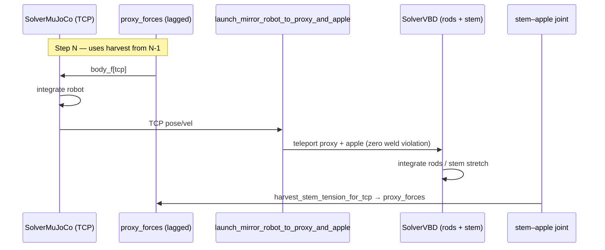
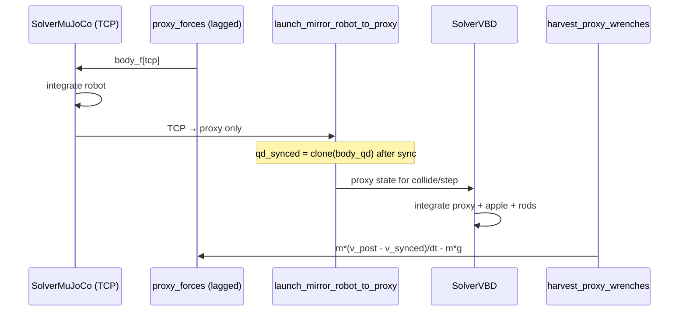

# MuJoCo + VBD two-Model coupling architecture (M1)

This document describes how the **apple-picking fruiting stack** splits simulation across two Newton `Model` instances, which solver **owns** which part of the scene graph, and how **`fruiting_system/`**, **`coupled_fruiting/`**, and **`coupled_fruiting/proxy_coupling.py`** cooperate. It matches the implementation as of **[M1] Slice 2f** (`docs/ROADMAP.md`, `docs/slice-2f-structural-refactor.md`).

**Naming:** The cable side uses **`SolverVBD`** (variational rigid/cable integrator in Newton). The robot side uses **`SolverMuJoCo`** (MuJoCo embedded in Newton). There is **no separate MuJoCo process**—both solvers run inside the same Newton/Warp host.

---

## 1. Why two models

| Constraint | Implication |
|------------|-------------|
| `SolverMuJoCo` does **not** support `JointType.CABLE` | The rod backbone (primary → … → stem) **cannot** live on the robot model. |
| `SolverVBD` is the natural fit for cable rods + fruiting fixed joints | The tree, apple, and gripper proxy live on **`cable_model`**. |
| FR3 / arm tracking belongs on MuJoCo | The arm lives on **`robot_model`**. |

Newton’s **single-model, two-solver** pattern (e.g. Featherstone + VBD on one `Model`, as in `example_cloth_franka.py`) does **not** apply here. M1 uses **two `Model`s** linked by **proxy bodies** and a **staggered, one-step-lag** wrench exchange.

---

## 2. Per-model ownership (who is master of what)

### 2.1 High-level split

| Model | Solver | Role | Apple on this model? |
|-------|--------|------|----------------------|
| **Model A** — `robot_model` | `SolverMuJoCo` | Articulated robot (today: placeholder free-floating TCP box; target: FR3 + custom EE) | **No** |
| **Model B** — `cable_model` | `SolverVBD` | Fruiting rod tree, apple, gripper proxy, ground | **Yes** |

Forces **never** cross `Model` boundaries as shared joints. All cross-model interaction goes through:

- **`ProxyBodyRegistry`**: `robot_tcp_body_id → cable.gripper_proxy_body`
- **`proxy_forces`**: spatial wrench buffer indexed by **robot** body id, harvested after VBD, applied on the **next** substep to MuJoCo

### 2.2 Cable tree (Model B) — body and joint masters

The cable scene is built by `generate_coupled_cable_scene` in `fruiting_system/coupled.py` (same chain as P0 `generate_scene`, plus gripper proxy).

```
world (ground plane)
  └── primary[0]  ← PINNED (inv_mass = 0, world-fixed base)
        └── … cable joints (bend/stretch per segment)
              └── …
                    └── stem tip
                          └── [FIXED] joint_{last_rod}_apple  ← stem–apple (VBD constraint)
                                └── apple
                                      └── [FIXED] joint_apple_gripper_proxy  (if fix_to_apple)
                                            └── gripper_proxy  (+ collision box)
```

| Part of tree | Pose / velocity “master” each substep | Dynamics integrated by |
|--------------|----------------------------------------|-------------------------|
| **Primary base** | **World** (pinned, `inv_mass = 0`) | Not moved by VBD integration |
| **Rod segments** (primary → secondary → spur → stem) | **VBD** (`add_rod` cable joints) | **VBD** |
| **Stem–apple FIXED joint** | Child pose tied to stem + apple geometry at build time; during coupled step, apple pose may be **overridden** (see below) | **VBD** constraint solve (reaction harvested on stem path) |
| **Apple** (`fix_to_apple=True`) | **Robot TCP** via `sync_proxy_and_apple_state` (teleport + prescribed `inv_mass = 0`) | Not free-falling; stem tension comes from VBD |
| **Apple** (`fix_to_apple=False`) | **VBD** (free dynamics + contacts) | **VBD** |
| **Gripper proxy** | **Robot TCP** pose copied every substep after MuJoCo | **VBD** for contact impulses; pose is kinematic input |
| **Gripper proxy ↔ apple** | **FIXED** weld when `fix_to_apple=True`; co-teleported with TCP | Constraint kept at zero violation by sync |

**P0 telemetry** on the cable tree (`measure_fruiting_forces`, `fruiting_fixed_joints`, `vbd_fixed_joint_wrenches.py`) is **independent** of the proxy wrench channel unless you explicitly correlate them in analysis.

### 2.3 Robot (Model A) — body masters

| Part | Master |
|------|--------|
| **TCP / EE body** | **MuJoCo** integrates pose/velocity from internal dynamics + **lagged** `body_f[tcp]` (harvested VBD load from previous substep) + any user EE wrench |
| **Rest of arm** (placeholder: none; FR3: full chain) | **MuJoCo** |

After each MuJoCo substep, the TCP state on `robot_state_0` is the **kinematic authority** for mirroring onto the cable proxy (step 3 of the coupling loop).

### 2.4 Summary table — “who wins” in coupled mode

| Quantity | Authority |
|----------|-----------|
| Robot TCP `body_q`, `body_qd` | **MuJoCo** (Model A) |
| Proxy `body_q`, `body_qd` (after sync) | **Copied from robot TCP**, with velocity correction (see §5) |
| Apple `body_q`, `body_qd` when `fix_to_apple=True` | **Derived from TCP** in `sync_proxy_and_apple_state` |
| Rod backbone motion | **VBD** |
| External load on robot TCP from fruit | **Lagged harvest** → `body_f[tcp]` next substep |
| EE–apple contact impulses (on cable) | **VBD** collision solve on proxy/apple shapes |

---

## 3. Module responsibilities

### 3.1 `apple_pick_sim/fruiting_system/` package

**Purpose:** Scene **generation** and **VBD-only** simulation helpers for the fruiting system (P0 + M1 cable model). Layout: `params.py`, `build.py`, `scene.py`, `coupled.py`; re-exported from `apple_pick_sim.fruiting_system`.

| Responsibility | Key symbols |
|----------------|-------------|
| Load JSON ranges, deterministic sampling | `load_ranges`, `sample_params`, `FruitingSystemParams` |
| Build **P0** VBD-only scene | `generate_scene` → `FruitingSystemScene` |
| Build **M1 cable** scene (Model B) | `generate_coupled_cable_scene` → `CoupledCableScene` |
| Rod chain topology | `_build_fruiting_chain_into_builder`: primary → secondary → spur → stem → apple |
| Gripper proxy geometry and joints | `_add_gripper_proxy`, `GripperProxyConfig` |
| Default VBD solver settings | `make_fruiting_solver_vbd` |
| P0 fixed-joint wrench API | `measure_fruiting_forces`, `iter_fruiting_fixed_joint_indices` |
| Document staggered protocol (overview) | Module docstring § “Staggered VBD ↔ MuJoCo force transfer” |

**Does not:** Step MuJoCo, run `coupled_substep`, or implement Warp sync/harvest kernels (those live in the other two modules).

**`CoupledCableScene`** extends `FruitingSystemScene` with:

- `gripper_proxy_body`, `gripper_proxy_config`
- Optional `gripper_proxy_apple_joint` and `gripper_proxy_offset_in_apple_frame` when `fix_to_apple=True`
- `proxy_registry(robot_body_id)` for the robot↔proxy id map

### 3.2 `apple_pick_sim/coupled_fruiting/` package

**Purpose:** **Orchestration** of the two-solver staggered loop (M1 Slice 2b). Layout: `scene.py` (substep loop), `builders.py`, `bootstrap.py`, `apply_wrench.py`, `stem.py`.

| Responsibility | Key symbols |
|----------------|-------------|
| Wire Model A + Model B + buffers | `build_coupled_fruiting_placeholder` |
| Placeholder robot (until FR3 USD) | `build_placeholder_tcp_robot_model` |
| Authoritative substep loop | `CoupledFruitingScene.coupled_substep` |
| MuJoCo-only / VBD-only modes | `mujoco_substep`, `vbd_substep` |
| Apply lagged wrench to robot | `_apply_tcp_spatial_wrench_kernel` via `_apply_spatial_wrench_to_body_f` (device) |
| Choose sync + harvest path | `_mujoco_and_sync_proxy`, stem joint discovery `_find_stem_apple_joint` |
| Initial TCP alignment | `bootstrap_tcp_joint_from_proxy` |

**Owns runtime state:** `robot_model`, `mj_solver`, `robot_state_*`, `proxy_forces`, `coupling_forces_cache`, `stem_apple_joint_index`, stem coupling gain/caps.

**Does not:** Define Warp kernels (delegates to `coupled_fruiting/proxy_coupling.py`).

### 3.3 `apple_pick_sim/coupled_fruiting/proxy_coupling.py`

**Purpose:** **Low-level coupling primitives** — Warp kernels and small CPU helpers for mirror, harvest, and VBD consistency.

| Responsibility | Key symbols |
|----------------|-------------|
| Robot↔proxy id map | `ProxyBodyRegistry` |
| Mirror TCP → proxy; undo double integration | `mirror_robot_tcp_to_proxy_kernel`, `launch_mirror_robot_to_proxy` |
| Mirror TCP → proxy **and** apple (`fix_to_apple`) | `mirror_robot_tcp_to_proxy_and_apple_kernel`, `launch_mirror_robot_to_proxy_and_apple` |
| Harvest via velocity jump (roadmap option 3) | `compute_proxy_reaction_wrench_kernel`, `launch_compute_proxy_reaction_wrench`, `harvest_proxy_wrenches` |
| Harvest via stem–apple joint reaction | `harvest_stem_tension_for_tcp`, `limit_stem_coupling_wrench` |
| Fix spurious VBD twist after kinematic sync | `align_proxy_body_q_prev_for_vbd` |
| Clear wrench slots | `zero_robot_wrench_slots` |

**Does not:** Build scenes or call `mj_solver.step` / `cable.solver.step`.

---

## 4. Staggered substep protocol (AVBD ↔ MuJoCo sync)

The **authoritative loop** is `CoupledFruitingScene.coupled_substep(dt)`. Spatial wrenches are **world frame**, linear then angular `[N, N·m]`. Coupling is **explicit** with **one substep lag** (`proxy_forces` from step *N−1* applied at step *N*).

### 4.1 Shared steps (both harvest paths)

```
Substep N
=========
(1) robot_state.clear_forces()
    coupling_forces_cache ← proxy_forces          # snapshot lagged wrench
    body_f[tcp] ← coupling_forces_cache[tcp]    # MuJoCo ← VBD (lagged)

(2) mj_solver.step(robot_model, dt)             # Model A advances

(3) launch_mirror_robot_to_proxy  OR  launch_mirror_robot_to_proxy_and_apple
    robot TCP body_q/body_qd  →  cable proxy (± apple)
    subtract same lagged wrench + gravity from proxy velocity
    align_proxy_body_q_prev_for_vbd(proxy [, apple])

(4) cable.state.clear_forces(); collide; vbd_solver.step(cable, dt)

(5) harvest → proxy_forces  (for step N+1)
```

### 4.2 Path A — Stem harvest at TCP (default when an apple exists)

Used whenever the cable scene has an **apple** (`stem_apple_joint_index` set). With **`fix_to_apple=True`**, the proxy is **FIXED** to the apple and both are **prescribed** (`inv_mass = 0`; **`body_mass` retained** for readouts and constraint semantics).



- **Sync:** Proxy and apple share TCP-corrected velocity; apple position reverses `proxy_offset_in_apple`.
- **Harvest:** `harvest_stem_tension_for_tcp` reads the **stem–apple FIXED** constraint via `fixed_joint_wrenches_child_com_vbd` (not velocity delta on the proxy).
- **Explicit apple weight (default on):** When `stem_harvest_explicit_apple_weight=True`, adds **`-m_apple · gravity`** and **\((p_{\mathrm{apple}} - p_{\mathrm{tcp}}) \times F_{\mathrm{add}}\)** before gain/caps (`explicit_load.py`). Prescribed apples (`inv_mass == 0`) do not integrate gravity; this restores quasi-static weight and moment at the flange.
- **Feedback tuning:** `stem_coupling_gain` defaults to **1.0** (full stem reaction at TCP). Optional `stem_force_cap_N`, `stem_torque_cap_Nm` clamp lagged feedback. Use `stem_coupling_gain < 1` only when under-relaxing unstable teleop.

**Intent:** Tree load on the arm is **stem gather + optional explicit apple support**; disable explicit load with `CoupledFruitingScene.stem_harvest_explicit_apple_weight = False` to compare raw joint reactions only.

### 4.3 Path B — Free proxy sync + velocity-delta harvest (no apple only)

**Fallback** when there is **no apple** (`stem_apple_joint_index is None`). Fruiting scenes with an apple use Path A (§4.2) even when `fix_to_apple=False` (proxy-only sync, dynamic apple on stem).



- **Harvest:** `harvest_proxy_wrenches` reconstructs net wrench on the proxy from the **velocity jump** across the VBD substep (roadmap **option 3**; direct VBD accumulator read is reserved for a future slice).

---

## 5. Sync mechanics (avoiding double integration)

### 5.1 Why velocity is modified, not just pose copied

MuJoCo already applied the **lagged coupling wrench** to the TCP in step (1)–(2). If VBD integrated the proxy with that same wrench still “in” the velocity, the cable side would **double-count** the coupling impulse.

`launch_mirror_robot_to_proxy` (and the proxy half of `launch_mirror_robot_to_proxy_and_apple`) sets:

- `body_q[proxy] = body_q[robot_tcp]`
- `body_qd[proxy]` from robot twist, minus:
  - `Δv_coupling = dt * inv_m * F_lagged`
  - `Δω_coupling` from lagged torque and proxy inertia
  - `gravity * dt` on the linear part (world gravity on cable model)

The `gravity` argument is `CoupledFruitingScene.gravity_vec` (Model B / VBD, default −9.81 m/s²), **not** `robot_model.gravity` (Model A is zero-g for teleop).

The same `coupling_forces_cache` used for `body_f` is passed into the kernel as `proxy_forces`.

### 5.2 `align_proxy_body_q_prev_for_vbd`

Kinematic overwrite of `body_q` without updating `SolverVBD.body_q_prev` makes VBD infer a huge twist `(body_q - body_q_prev) / dt`. After sync, **`body_q_prev` on proxy (and apple when co-synced) is aligned** to post-sync `body_q`.

**Implementation (Slice 2e):** `_align_body_q_prev_kernel` in `coupled_fruiting/proxy_coupling.py` copies only the listed body indices on device (`wp.launch` over `body_ids`); no full `body_q` / `body_q_prev` host roundtrip. Tests: `test_align_proxy_body_q_prev_for_vbd_clears_finalize_spurious_velocity`, `test_align_proxy_body_q_prev_with_multiple_bodies` in `test_proxy_coupling.py`.

### 5.3 Bootstrap

`bootstrap_tcp_joint_from_proxy` runs once at build: robot free joint coords are initialized from the cable proxy pose so both models start consistent.

---

## 6. Data buffers and indexing

| Buffer | Shape / index | Written | Read |
|--------|---------------|---------|------|
| `proxy_forces` | `robot_model.body_count`, spatial vector | Harvest step (5) | Apply step (1) **next** substep |
| `coupling_forces_cache` | Same | Copy of `proxy_forces` at (1) | Sync kernel (3) same substep |
| `robot_state_0.body_f` | Per-body 6-vector | (1) TCP slot only | MuJoCo step (2) |
| `cable.state_0.body_q`, `body_qd` | Cable bodies | Sync (3), VBD (4) | VBD collide/step |

`ProxyBodyRegistry` holds sorted `(robot_body_id, proxy_body_id)` pairs; M1 placeholder uses a single TCP ↔ proxy pair.

---

## 7. Example step modes (`examples/examples/example_coupled_fruiting.py`)

| CLI flag | `CoupledFruitingScene` | Per substep | Newton viewer shows |
|----------|------------------------|-------------|---------------------|
| *(none)* | `coupled_substep` | MuJoCo → sync → VBD → harvest | Cable tree + proxy (tracks TCP) |
| `--only-vbd` | `vbd_substep` | VBD only | Cable tree (proxy not mirrored from robot) |
| `--only-mjc` | `mujoco_substep` | MuJoCo → sync (no VBD, no harvest update) | Cable tree static except proxy pose from sync |

**FR3 keyboard teleop** (`--robot fr3 --fr3-keyboard`): `apply_fr3_ee_teleop` runs once per **frame** (IK → `joint_target_*`), then substeps call `mujoco_substep` or `coupled_substep`. As of 2026-05-19, interactive arm motion is **verified** only with **`--only-mjc`** and default **`fix_to_apple=False`**; full coupled teleop is not yet confirmed in the viewer.

---

## 8. End-to-end call graph (typical run)

```
examples/example_coupled_fruiting.py
  └── build_coupled_fruiting_placeholder()  # or build_coupled_fruiting_fr3()
        ├── fruiting_system.generate_coupled_cable_scene()   # Model B
        └── robot model (placeholder TCP or FR3 USD)           # Model A
  └── each frame: optional apply_fr3_ee_teleop(frame_dt)
  └── each substep: coupled_substep(dt)  # or mujoco_substep / vbd_substep
        ├── _mujoco_and_sync_proxy()
        │     ├── proxy_coupling.launch_mirror_robot_to_proxy*()
        │     └── proxy_coupling.align_proxy_body_q_prev_for_vbd()
        ├── [coupled only] cable.model.collide + cable.solver.step()
        └── [coupled only] proxy_coupling.harvest_*()
```

---

## 9. Tests and verification

| Area | Tests | Command (repo root) |
|------|-------|---------------------|
| Sync / harvest kernels | `apple_pick_sim/tests/test_proxy_coupling.py` | `PYTHONPATH=$(pwd) uv run --directory newton python -m pytest ../apple_pick_sim/tests/test_proxy_coupling.py -q -p no:launch_testing` |
| Coupled / MJC-only loop | `apple_pick_sim/tests/test_coupled_fruiting_system.py` | See `README.md` / `docs/ROADMAP.md` |
| FR3 teleop (headless) | `test_fr3_ee_velocity_controller.py`, `test_fr3_ee_teleop_drives_mujoco_joint_targets` | `pytest` paths in `docs/fr3-usd-import-implementation.md` |
| P0 fixed-joint readouts | `apple_pick_sim/tests/test_wrench_equilibrium.py` | Documented in `docs/WRENCH_READOUT.md` |
| Interactive FR3 teleop | `examples/example_coupled_fruiting.py --robot fr3 --only-mjc --fr3-keyboard` | See `README.md` |

---

## 10. Related docs

- `docs/ROADMAP.md` — [M1] objective, per-model table, coupling protocol, harvest options 1–3
- `docs/slice-2f-structural-refactor.md` — package layout, gate pytest commands
- `docs/fr3-usd-import-implementation.md` — FR3 USD import, keyboard teleop entry points
- `docs/WRENCH_READOUT.md` — fixed-joint wrench semantics (stem harvest path)
- `apple_pick_sim/fruiting_system/coupled.py` — staggered protocol overview (M1)
- `apple_pick_sim/coupled_fruiting/scene.py` — `CoupledFruitingScene` substep loop
