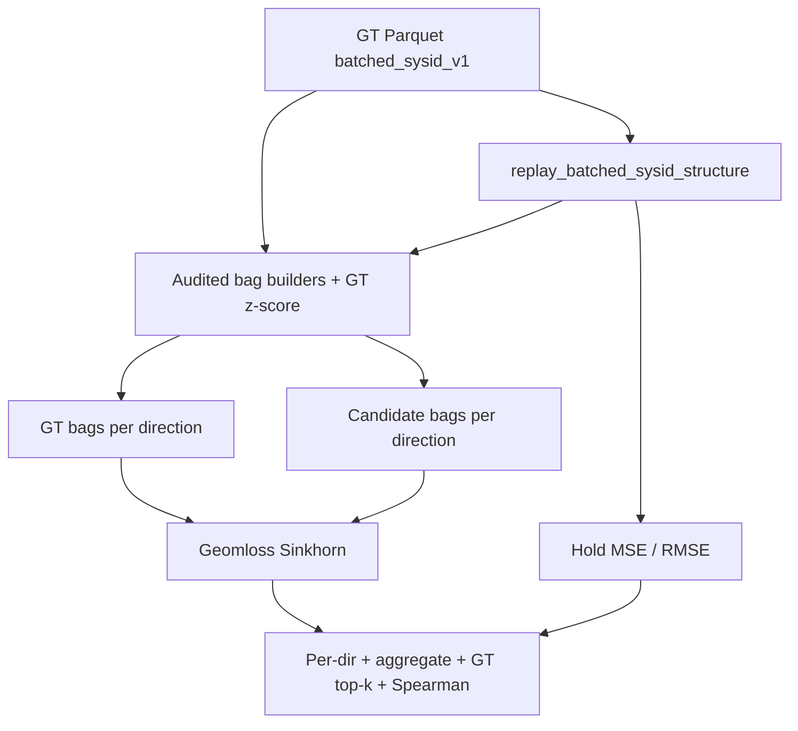

# Wasserstein (Sinkhorn) sys-ID ranking validation

**Status: Implemented** (2026-07-08+) — see `apple_pick_sim/system_id/wasserstein.py`, `wasserstein_ranking.py`, and `--score-wasserstein` on `example_batched_sysid_mmd_grid.py`. This file remains a historical design note.

Date: 2026-07-08  
Branch: `feature/batched-sysid-mmd`  
Scope: ranking validation only — Sinkhorn beside MSE on the batched stiffness grid. No CMA-ES loop, no GPU-only bag pipeline, no MMD CLI wiring.

## Goal

After batched grid replay of recorded quasi-static actions, score each bend-stiffness candidate with **Geomloss Sinkhorn divergence** on hold-phase transition bags, **alongside** existing hold MSE/RMSE. Use the side-by-side ranking to check:

1. **GT preference** — does the true stiffness minimize (or top-\(k\)) aggregate Sinkhorn?
2. **Agreement with MSE** — Spearman correlation between Sinkhorn ranks and hold MSE ranks (TCP/apple pose, force, torque).

This validates whether an OT objective is a sensible black-box loss before a later CMA-ES (or CEM) tuning loop.

## Decisions (locked)

| Topic | Choice |
| --- | --- |
| Role vs MSE | Sinkhorn **beside** MSE; MMD unused this slice |
| Loss | Geomloss `SamplesLoss("sinkhorn")` |
| Bag samples | Full latter-half hold transitions \(v_t = [s_t, \Delta s_t]\), not per-hold mean/median |
| Partition | Per excitation direction + mean aggregate |
| Normalization | Per-direction GT-only z-score; candidates never fit mean/std; ε-clamp near-zero std |
| Ranking checks | GT argmin / top-\(k\); Spearman vs hold MSE ranks |
| Old helpers | Reuse bag *idea*, but **audit with tests first**; fix bugs rather than trust blindly |

## Out of scope

- CMA-ES / CEM optimization loop
- GPU-resident feature construction and batched Geomloss over a population
- Wiring MMD into `example_batched_sysid_mmd_grid.py`
- Renaming all `mmd_*` modules to neutral names
- Chirp / instantaneous frequency \(f(t)\) features from `docs/system_identification.md` §3.1
- Per-hold aggregate bags as the OT input (too few samples for Sinkhorn)

## Feature bags

Reuse the transition encoding from `docs/system_identification.md` §3 and `apple_pick_sim/system_id/mmd_features.py`:

\[
v_t = [s_t,\, \Delta s_t], \quad \Delta s_t = s_{t+1} - s_t
\]

**State \(s_t\)** (current `STATE_VECTOR_FIELDS`): `ft_wrist`, `tcp_velocity`, `action`, `tcp_pos`, `apple_pos`, woody start/end positions, `woody_bending_angles`.

**Keep a transition only when all hold:**

1. `phase == 1` (hold)
2. Matching `dir_idx` (exact integer direction identity; do not key by floating vectors)
3. `stable == True` when the column exists
4. Frame is in the **latter half** of a contiguous hold run (first half discarded as burn-in)
5. Segment tail has ≥ 2 frames so at least one \((s_t, s_{t+1})\) pair exists

**Pre-weld rows** (`phase == -1`, `step_idx == -1`) must be stripped before bag build (`strip_pre_weld_rows`).

Bags are keyed by `dir_idx` (exact integer):

```text
dict[dir_idx, ndarray (N_transitions, D)]
D = 2 * |s_t| = 48 + 14J   (J = number of woody junctions)
```

**Why not per-hold mean/median?** Collapsing each hold to one point leaves too few samples for a stable Sinkhorn estimate. Latter-half hold frames are noisy around equilibrium; that empirical cloud is what OT compares. Hold-aggregated MSE remains the paired diagnostic (already implemented).

## Normalization

Mirror `prepare_gt_mmd_context` in `batched_sysid_mmd_grid.py`:

1. Build GT bags per direction from recorded episodes.
2. For each direction, `fit_gt_normalization(gt_features)` → mean/std from **that direction’s GT only**.
3. Apply the same stats to GT and every candidate for that direction.
4. Clamp `std < eps` to `eps` (default `1e-6`) so constant features do not explode.

Do **not** pool all directions into one global mean/std for this slice (keeps anisotropic scales and matches existing MMD context).

## Sinkhorn scoring

New module: `apple_pick_sim/system_id/wasserstein.py`.

```text
prepare_gt_wasserstein_context(recorded_episodes)
  → {direction: {gt_norm, stats}}

score_candidate_wasserstein(candidate, gt_context, replay_episodes)
  → per_direction_sinkhorn, aggregate_sinkhorn = transition-count-weighted-mean(per_direction)
```

- Device: CUDA torch when available, else CPU.
- Loss: `geomloss.SamplesLoss("sinkhorn")` with documented fixed defaults for this slice (no blur/p sweep).
- Pure function of bags so a future CMA-ES loop only needs: sample \(\theta\) → replay → bags → \(L(\theta)\).

### Edge cases

| Case | Behavior |
| --- | --- |
| Empty bag for a direction | Candidate is **DISQUALIFIED** (missing GT direction bag) |
| All directions empty | Raise a clear error (do not score 0) |
| Direction in GT missing in candidate | Warn + candidate is **DISQUALIFIED** (do not rank) |
| Direction in candidate missing in GT | Ignored for scoring (GT direction set is canonical) |
| \(N < N_{\min}\) (e.g. 8) | Still score; flag direction as low-sample in the report; aggregate is weighted by transition count |
| Unstable candidate (>10% unstable frames among GT-stable scored frames) | Mark **DISQUALIFIED** (same threshold as MSE); exclude from GT-preference win checks |
| `geomloss` missing | Fail at CLI start with install hint |
| Degenerate GT std | ε clamp (tested) |

## Ranking validation (with MSE)

Wire into `example_batched_sysid_mmd_grid.py` as `--score-wasserstein` (composable with `--score-mse`). Replay once; score both metrics from the same collectors.

Report:

1. Per-direction Sinkhorn and weighted aggregate per candidate
2. Existing hold MSE / RMSE table (unchanged semantics)
3. GT argmin / top-\(k\) under aggregate Sinkhorn (non-DISQUALIFIED only)
4. Spearman correlation between Sinkhorn ranks and hold MSE ranks for (excluding DISQUALIFIED candidates):
   - pose (`err_pos` / hold TCP+apple)
   - force RMSE
   - torque RMSE

## Architecture



## Audit stance (do not trust old code blindly)

Before shipping the scorer, strengthen tests that prove:

- Hold-only, burn-in, stable mask, pre-weld exclusion
- \(v_t = [s_t, \Delta s_t]\) pairing and dimension
- Direction keying
- GT-only normalization and ε clamp

If `mmd_features.py` / `mmd.py` / `combine_transition_features` fail those tests, **fix them in place**. Wasserstein must not paper over bag bugs.

## Dependency

- Add `geomloss` under the `gym` optional extra in `pyproject.toml` (torch via `vic` / `newton[torch-cu12]`).
- Sync and run:

```bash
uv sync --extra gym --extra vic --extra dev
uv run python apple_pick_gym/batched_examples/example_batched_sysid_mmd_grid.py \
  --dataset <batched_sysid_v1_dir> \
  --score-wasserstein --score-mse \
  --primary-bend-stiffness-values 10,25 \
  --secondary-bend-stiffness-values 10 \
  --spur-bend-stiffness-values 10 \
  --stem-bend-stiffness-values 10
```

- Sinkhorn hyperparameters (pinned): `SamplesLoss("sinkhorn", p=2, blur=1.0)`.
  (`blur=0.05` was too small for ~100-D GT-z-scored bags and produced \(10^{10}\)–\(10^{12}\)
  spikes on outlier directions; raised to `1.0` after the first grid validation run.)

## Tests (TDD order)

1. Bag contract — synthetic episodes with known hold runs → exact bag sizes and contents
2. Normalization — candidate shift does not change GT stats; ε clamp
3. Sinkhorn unit — identical clouds ≈ 0; far shift > near shift; empty/missing directions; aggregate = mean
4. Ranking helpers — GT top-\(k\); Spearman on synthetic ranks
5. Grid wiring smoke — inject episode dicts where possible (avoid full GPU sim in unit tests)

## CMA-ES handoff (document only)

Intended future objective:

\[
L(\theta) = \mathrm{mean}_{\hat{u}}\, \mathrm{Sinkhorn}\bigl(P_{\hat{u}},\, Q_{\hat{u}}(\theta)\bigr)
\]

after per-direction GT z-score. Keep per-direction losses for diagnostics / optional anisotropic \(\theta\).

**Next slices (not this one):** GPU-resident bag build; batched Geomloss over a CMA-ES population; roadmap update once ranking validation looks good. Living CEM/MMD plan in `docs/system_identification.md` §4 remains until that decision.

## Code map (implemented)

| Piece | Location |
| --- | --- |
| Design (this doc) | `docs/specs/2026-07-08-wasserstein-sysid-ranking-design.md` |
| Bag builders (audited) | `apple_pick_sim/system_id/mmd_features.py` |
| GT z-score | `apple_pick_sim/system_id/mmd.py` |
| Sinkhorn scorer | `apple_pick_sim/system_id/wasserstein.py` (new) |
| Grid combine / replay | `apple_pick_gym/batched_envs/batched_sysid_mmd_grid.py` |
| CLI | `apple_pick_gym/batched_examples/example_batched_sysid_mmd_grid.py` |
| MSE / viz ranks | `apple_pick_gym/grid_viz_table.py` (reuse patterns) |

## Related docs

- `docs/system_identification.md` — transition features, CEM/MMD plan
- `docs/specs/2026-07-07-batched-sysid-mmd-grid-visualization-design.md` — MSE landscape viz
- `docs/sysid-mmd-grid-replay-alignment.md` — pre-weld / weld alignment
- `docs/batched-sysid-dataset.md` — `batched_sysid_v1` layout
