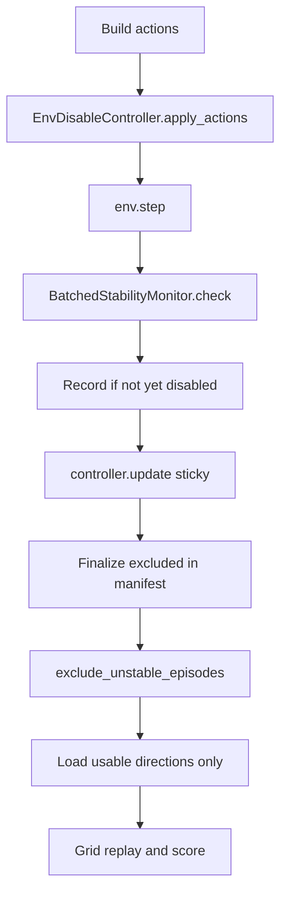

# Sys-ID Stable Collect & Replay Implementation Plan

> **For agentic workers:** REQUIRED SUB-SKILL: Use superpowers:subagent-driven-development (recommended) or superpowers:executing-plans to implement this plan task-by-task. Steps use checkbox (`- [ ]`) syntax for tracking.

**Goal:** Soft-disable blown-up envs mid-collect/replay (zero actions, stop recording), mark episodes `excluded` in the manifest, provide an offline `stable=False` filter, and skip excluded `(structure, direction)` pairs in default grid load/scoring.

**Architecture:** New GPU-resident `EnvDisableController` shared by collect and replay. Manifest grows `excluded` / `excluded_reason`. Loaders remapped over **usable directions only** (dense `num_directions'`) so `env_idx = cand * n_usable + local_dir` stays valid. Offline filter patches manifest from Parquet `stable` columns.

**Tech stack:** PyTorch (device bool masks), existing `BatchedStabilityMonitor`, `batched_sysid_v1` Parquet/manifest, pytest + `uv run --env-file pytest.env`.

**Spec:** [docs/superpowers/specs/2026-07-12-sysid-stable-collect-replay-design.md](docs/superpowers/specs/2026-07-12-sysid-stable-collect-replay-design.md)

**Worktree (do first, before production edits):**

```bash
git worktree add ../apple_pick_sim-sysid-stable-collect -b feature/sysid-stable-collect
cd ../apple_pick_sim-sysid-stable-collect
git submodule update --init --recursive
uv sync --extra gym --extra vic --extra dev
```

Open that folder in a new Cursor window for implementation. All paths below are relative to the worktree root. Also save this plan as `docs/superpowers/plans/2026-07-12-sysid-stable-collect-replay.md` in the worktree (commit with Task 0).



---

## File map

| File | Responsibility |
|------|----------------|
| Create `apple_pick_gym/batched_envs/env_disable_controller.py` | Sticky `disabled` mask; `update` / `apply_actions` / `disabled_cpu` helpers |
| Create `apple_pick_gym/batched_envs/exclude_unstable_episodes.py` | Offline filter + CLI `main` |
| Modify `apple_pick_gym/batched_envs/batched_sysid_collect.py` | Wire controller; extend `_build_manifest_episodes` |
| Modify `apple_pick_gym/batched_envs/batched_sysid_mmd_grid.py` | Usable-direction helpers; wire controller in replay; skip excluded in loaders |
| Modify `apple_pick_gym/batched_examples/example_batched_sysid_mmd_grid.py` | `--include-excluded`; clear empty-structure error |
| Modify `scripts/collect_and_rank_sysid_gt.sh` | Run filter between collect and GT-rank |
| Modify `docs/batched-sysid-dataset.md` | Document `excluded` fields |
| Modify `docs/batched-stability-monitor-design.md` | Sync thresholds (30 N / 10 Nm / 0.5 m/s); note blow-up meaning |
| Modify `docs/ROADMAP.md` | Note V.5.1 precursor slice shipped when done |
| Tests under `apple_pick_gym/tests/` | Controller, filter, collect/manifest, load/replay helpers |

**Locked remapping rule:** Do not leave holes in the direction axis. `list_usable_direction_indices(dataset, structure_idx) -> list[int]` returns non-excluded direction indices in ascending order. All loaders/replay use `direction_indices=usable` and set `num_directions=len(usable)`. If `usable` is empty for a structure → raise `ValueError` with structure index and excluded count (no silent empty grid).

**Collect record order (spec):** apply_actions → step → monitor → **record** (includes blow-up frame) → **then** `update` sticky.

---

### Task 0: Worktree + plan file

- [ ] **Step 1:** Create worktree and sync (commands above).
- [ ] **Step 2:** Copy/write this plan to `docs/superpowers/plans/2026-07-12-sysid-stable-collect-replay.md`.
- [ ] **Step 3:** Commit plan-only on the feature branch.

```bash
git add docs/superpowers/plans/2026-07-12-sysid-stable-collect-replay.md
git commit -m "$(cat <<'EOF'
Add implementation plan for sys-ID stable collect/replay.

EOF
)"
```

---

### Task 1: `EnvDisableController` (TDD)

**Files:**
- Create: `apple_pick_gym/batched_envs/env_disable_controller.py`
- Test: `apple_pick_gym/tests/test_env_disable_controller.py`

- [ ] **Step 1: Write failing tests**

```python
import torch
from apple_pick_gym.batched_envs.env_disable_controller import EnvDisableController

def test_update_is_sticky_or():
    c = EnvDisableController(num_envs=3, device="cpu")
    c.update(torch.tensor([False, True, False]))
    c.update(torch.tensor([True, False, False]))
    assert c.disabled.tolist() == [True, True, False]

def test_apply_actions_zeros_disabled_rows_preserves_device_dtype():
    c = EnvDisableController(num_envs=2, device="cpu")
    c.update(torch.tensor([False, True]))
    actions = torch.ones(2, 6, dtype=torch.float32)
    out = c.apply_actions(actions)
    assert out.dtype == torch.float32
    assert out[0].tolist() == [1, 1, 1, 1, 1, 1]
    assert out[1].tolist() == [0, 0, 0, 0, 0, 0]
    assert actions[1, 0].item() == 1.0  # input not mutated

def test_should_record_mask_is_not_disabled():
    c = EnvDisableController(num_envs=2, device="cpu")
    c.update(torch.tensor([True, False]))
    assert c.should_record_mask().tolist() == [False, True]

def test_apply_actions_and_update_do_not_require_item_calls():
    # Structural: methods must not call .item()/.cpu()/.numpy() on tensors.
    # Implement by code review + optional monkeypatch assert if desired.
    c = EnvDisableController(num_envs=4, device="cpu")
    unstable = torch.zeros(4, dtype=torch.bool)
    unstable[2] = True
    c.update(unstable)
    _ = c.apply_actions(torch.randn(4, 6))
```

- [ ] **Step 2:** Run — expect import/fail.

```bash
uv run --env-file pytest.env python -m pytest apple_pick_gym/tests/test_env_disable_controller.py -q
```

- [ ] **Step 3: Implement**

```python
# apple_pick_gym/batched_envs/env_disable_controller.py
class EnvDisableController:
    def __init__(self, num_envs: int, *, device: torch.device | str, initial_disabled: torch.Tensor | None = None):
        self._num_envs = int(num_envs)
        self._device = torch.device(device)
        self.disabled = torch.zeros(self._num_envs, dtype=torch.bool, device=self._device)
        if initial_disabled is not None:
            self.update(initial_disabled)

    def update(self, unstable: torch.Tensor) -> None:
        mask = unstable.to(device=self._device, dtype=torch.bool).reshape(-1)
        if int(mask.numel()) != self._num_envs:
            raise ValueError(...)
        self.disabled |= mask

    def apply_actions(self, actions: torch.Tensor) -> torch.Tensor:
        # vectorized; no per-env Python; no .item()
        out = actions.clone()
        out[self.disabled] = 0
        return out

    def should_record_mask(self) -> torch.Tensor:
        return ~self.disabled
```

- [ ] **Step 4:** Re-run tests — PASS.
- [ ] **Step 5:** Commit `feat: add EnvDisableController for sticky soft-disable`.

---

### Task 2: Manifest `excluded` fields + collect wiring (TDD)

**Files:**
- Modify: `apple_pick_gym/batched_envs/batched_sysid_collect.py` (`_build_manifest_episodes` ~L334, collect loop ~L417–542)
- Modify/extend: `apple_pick_gym/tests/test_batched_sysid_collect.py` (unit tests for episode builder; mocked loop if needed)
- Prefer unit-testing `_build_manifest_episodes` with fake writers rather than full FR3 for exclusion flags

- [ ] **Step 1: Failing test for manifest episode fields**

Extend `_build_manifest_episodes` signature:

```python
def _build_manifest_episodes(
    metadata_rows,
    writers,
    *,
    num_directions: int,
    excluded_env_indices: set[int] | frozenset[int] = frozenset(),
    excluded_reason: str = "stability_blowup",
) -> list[dict]:
```

Each episode dict gains:

```python
"excluded": env_idx in excluded_env_indices,
"excluded_reason": excluded_reason if env_idx in excluded_env_indices else None,
```

- [ ] **Step 2: Wire collect loop**

```python
disable_ctrl = EnvDisableController(
    num_envs,
    device=env.device,
    initial_disabled=initial_unstable.to(device=env.device),
)
# in loop:
actions = actions_tensor_for_velocity(...)
actions = disable_ctrl.apply_actions(actions)
obs, ... = env.step(actions)
step_report = monitor.check(obs, step_idx=step_idx)
record_mask = disable_ctrl.should_record_mask()  # before update
# host loop OK for I/O:
record_host = record_mask.detach()  # single sync per step acceptable for recording gate
for i in range(num_envs):
    if not bool(record_host[i]):  # only .item for I/O gate
        continue
    collectors.record_step(..., stable=not bool(step_report.unstable[i].item()))
disable_ctrl.update(step_report.unstable)
```

On finalize, `excluded_env_indices` = indices where `disable_ctrl.disabled` is True **or** any written frame has `stable=False` (scan writers / collectors if needed). Simplest reliable rule: any env in `disable_ctrl.disabled` after the run, plus any env whose writer frames contain `stable=False`.

Pre-weld: if `initial_unstable[i]`, still write pre_weld with `stable=False` once; env starts disabled so trajectory actions stay zero and no post-weld frames (or only until first check — with initial_disabled, `should_record_mask` is False from the start of the main loop). **Decision locked:** with `initial_disabled=initial_unstable`, skip main-loop recording for those envs entirely; pre_weld row may still exist with `stable=False`; mark excluded.

- [ ] **Step 3:** Unit test `_build_manifest_episodes` excluded flags; optional MagicMock collect-loop test asserting `apply_actions` / skip record (follow `test_batched_sysid_mmd_grid_helpers` mock style if FR3 too heavy).
- [ ] **Step 4:** Commit `feat: soft-disable blown envs during batched sys-ID collect`.

---

### Task 3: Offline filter `exclude_unstable_episodes` (TDD)

**Files:**
- Create: `apple_pick_gym/batched_envs/exclude_unstable_episodes.py`
- Create: `apple_pick_gym/tests/test_exclude_unstable_episodes.py`
- Optional CLI entry: `python -m apple_pick_gym.batched_envs.exclude_unstable_episodes`

- [ ] **Step 1: Failing tests** using temp dataset: write minimal manifest + parquet via existing `BatchedEpisodeWriter` / store helpers (see `test_batched_trajectory_store.py`).

```python
def test_exclude_marks_episode_with_any_unstable_frame(tmp_path):
    # one episode all stable, one with a False in stable → excluded True/False

def test_exclude_without_inplace_writes_manifest_filtered_json(tmp_path):
    # leaves manifest.json unchanged; writes manifest.filtered.json

def test_exclude_inplace_backs_up_then_rewrites(tmp_path):
    # writes manifest.pre_exclude.json then updates manifest.json
```

- [ ] **Step 2: Implement**

```python
EXCLUDED_REASON = "stability_blowup"

def exclude_unstable_episodes(dataset_dir: Path | str, *, inplace: bool = False) -> Path:
    dataset = BatchedSysIdDataset(dataset_dir)
    episodes = list(dataset.episode_entries())
    for ep in episodes:
        arrays = dataset.load_episode_obs_arrays(ep["structure_idx"], ep["direction_idx"])
        unstable_any = not bool(np.asarray(arrays["stable"], dtype=bool).all())
        if unstable_any or bool(ep.get("excluded", False)):
            ep["excluded"] = True
            ep["excluded_reason"] = ep.get("excluded_reason") or EXCLUDED_REASON
        else:
            ep.setdefault("excluded", False)
            ep.setdefault("excluded_reason", None)
    # rewrite manifest payload with updated episodes
    ...
```

CLI: `--dataset`, `--inplace`.

- [ ] **Step 3:** Commit `feat: add offline exclude_unstable_episodes filter`.

---

### Task 4: Usable-direction load helpers + grid skip (TDD)

**Files:**
- Modify: `apple_pick_gym/batched_envs/batched_sysid_mmd_grid.py`
  - Add `episode_is_excluded(entry) -> bool`
  - Add `list_usable_direction_indices(dataset, structure_idx) -> list[int]`
  - Change `load_recorded_episodes_for_structure`, `build_recorded_actions_tensor`, `recorded_metadata_by_env` to accept `direction_indices: Sequence[int] | None = None` and `include_excluded: bool = False`
- Modify: `apple_pick_gym/tests/test_batched_sysid_mmd_grid_helpers.py` with `_make_mock_dataset` extended to `episode_entries` / `manifest`

**Behavior:**

```python
def list_usable_direction_indices(dataset, structure_idx, *, include_excluded=False) -> list[int]:
    idxs = []
    for ep in dataset.episode_entries():
        if int(ep["structure_idx"]) != int(structure_idx):
            continue
        if include_excluded or not bool(ep.get("excluded", False)):
            idxs.append(int(ep["direction_idx"]))
    idxs = sorted(idxs)
    if not idxs:
        raise ValueError(f"structure {structure_idx} has no usable directions (all excluded)")
    return idxs
```

When `direction_indices` provided, iterate those only; `num_directions` for replay = `len(direction_indices)`.

Call sites in `evaluate_batched_mmd_grid` / example `_run`: resolve usable list per structure, pass through, use `len(usable)` as `num_directions` for chunking/replay.

- [ ] **Step 1:** Failing helper tests (mock dataset with excluded episode).
- [ ] **Step 2:** Implement helpers + update three loaders + call sites.
- [ ] **Step 3:** Commit `feat: skip excluded sys-ID episodes in grid load`.

---

### Task 5: Replay soft-disable wiring (TDD)

**Files:**
- Modify: `apple_pick_gym/batched_envs/batched_sysid_mmd_grid.py` — `replay_batched_sysid_structure` (~L1170–1206), `BatchedSysIdReplayCollectors.record_all_envs_step`
- Test: extend `test_batched_sysid_mmd_grid_helpers.py` with MagicMock env

- [ ] **Step 1: Extend `record_all_envs_step`**

```python
def record_all_envs_step(..., unstable=None, record_mask: torch.Tensor | np.ndarray | None = None):
    ...
    for env_idx in range(num_envs):
        if record_mask is not None and not bool(record_mask_np[env_idx]):
            continue
        ...
```

- [ ] **Step 2: Wire replay loop** (same order as collect):

```python
disable_ctrl = EnvDisableController(num_envs, device=env.device, initial_disabled=initial_unstable.to(env.device))
for frame_idx in range(n_frames):
    actions = actions_tensor_from_recorded_frame(...)
    actions = disable_ctrl.apply_actions(actions)
    env.step(actions)
    ...
    step_report = monitor.check(last_obs, step_idx=frame_idx)
    collectors.record_all_envs_step(
        env, frame_idx=frame_idx, unstable=step_report.unstable,
        record_mask=disable_ctrl.should_record_mask(),
    )
    disable_ctrl.update(step_report.unstable)
```

- [ ] **Step 3:** Unit test with MagicMock: after unstable on env 1, later `record` not called for env 1; actions row 1 is zeros.
- [ ] **Step 4:** Commit `feat: soft-disable blown envs during batched sys-ID replay`.

---

### Task 6: CLI + shell script + docs

**Files:**
- Modify: `apple_pick_gym/batched_examples/example_batched_sysid_mmd_grid.py` — add `--include-excluded` (default false); thread to loaders
- Modify: `scripts/collect_and_rank_sysid_gt.sh` — after collect (and also when `SKIP_COLLECT=1`), run:

```bash
uv run python -m apple_pick_gym.batched_envs.exclude_unstable_episodes \
  --dataset "${DATASET}" --inplace
```

- Modify: `docs/batched-sysid-dataset.md` — document `excluded`, `excluded_reason`
- Modify: `docs/batched-stability-monitor-design.md` — fix stale 200/50/2.0 → current 30/10/0.5; state `stable` = blow-up/unsafe for exclude rule
- Modify: `docs/ROADMAP.md` — under V.5.1 / shipped wins, note blow-up isolation shipped (full loss hardening still next)

- [ ] **Step 1:** Implement CLI/script/docs.
- [ ] **Step 2:** Smoke:

```bash
uv run python -m apple_pick_gym.batched_envs.exclude_unstable_episodes --help
uv run python apple_pick_gym/batched_examples/example_batched_sysid_mmd_grid.py --help
```

- [ ] **Step 3:** Commit `docs: wire exclude filter into GT-rank script and document excluded episodes`.

---

### Task 7: Stability threshold documentation tests (light tune)

**Files:**
- `apple_pick_gym/tests/test_batched_stability_monitor.py` (already has nominal / force cap — ensure coverage matches “false positive” intent)
- Docs from Task 6

- [ ] Confirm `test_nominal_obs_is_stable` and `test_force_cap_exceeded` still pass with defaults.
- [ ] **Do not** change numeric thresholds unless a clear false-positive is demonstrated; if unchanged, document “defaults retained; deep dive follow-up” in the stability design doc.
- [ ] Commit only if docs/tests changed: `test: affirm stability thresholds for episode exclude rule`.

---

### Task 8: Full validation gate

```bash
uv run --env-file pytest.env python -m pytest \
  apple_pick_gym/tests/test_env_disable_controller.py \
  apple_pick_gym/tests/test_exclude_unstable_episodes.py \
  apple_pick_gym/tests/test_batched_stability_monitor.py \
  apple_pick_gym/tests/test_batched_sysid_mmd_grid_helpers.py \
  apple_pick_gym/tests/test_batched_sysid_collect.py \
  apple_pick_gym/tests/test_example_batched_sysid_mmd_grid_cli.py -q
```

Fix any regressions. Final commit if needed: `test: green gate for sys-ID stable collect/replay`.

---

## Spec coverage checklist

| Spec requirement | Task |
|------------------|------|
| Mid-collect soft-disable | 2 |
| Mid-replay soft-disable | 5 |
| Manifest excluded fields | 2 |
| Post-collect filter | 3, 6 |
| Grid skip excluded | 4 |
| Trustworthy stable / docs | 6, 7 |
| GPU hot path | 1 (enforced in controller) |
| Empty structure error | 4 |
| Shell script glue | 6 |
| Follow-ups (deep dive, horizon features, CEM, QS) | documented only — not implemented |

## Out of scope (do not implement)

Horizon features, QS hold filters, CEM penalties, per-env physics reset/restore, changing `__init__.py` exports unless needed.
