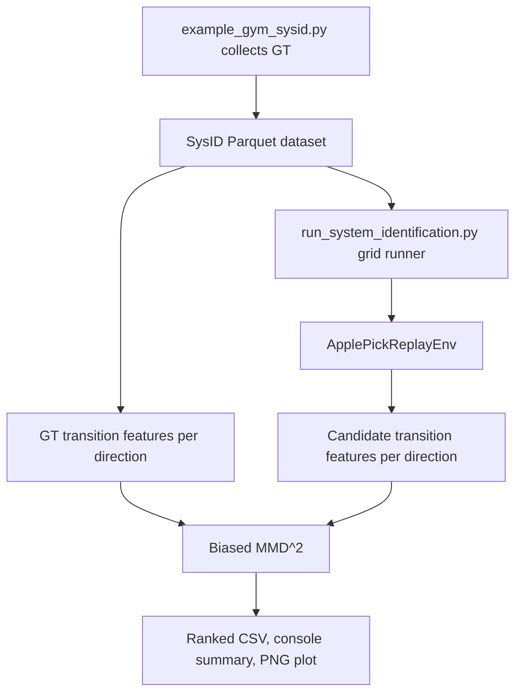

# MMD grid diagnostic design

## Status

Approved design for M3.1.1. This spec covers the diagnostic grid-search objective only. It does not tune simulator parameters, run CEM, update candidate distributions, or choose final calibration parameters.

## Goal

Collect ground-truth (GT) sys-ID trajectories from a known simulator parameter set, replay the same recorded end-effector velocity actions over a grid of alternate fruiting-system stiffness parameters, and rank candidates by biased RBF MMD over steady-state observable transition features.

The first workflow should answer: "Does the hold-phase MMD objective put lower loss near the GT stiffness set, and where does the stiffness loss landscape look ambiguous?"

## Existing data flow

GT collection uses `apple_pick_gym/examples/example_gym_sysid.py`. The script writes a sys-ID dataset directory with:

- `metadata.parquet`, one row per episode.
- `frames/<episode_id>.parquet`, one frame table per episode.
- `initial_states/<episode_id>.npz`, optional and privileged; not required for this diagnostic.

Candidate evaluation uses `apple_pick_gym/examples/run_system_identification.py`. It already iterates a Cartesian grid of `primary`, `secondary`, `spur`, and `stem` `bend_stiffness` values, loads each recorded episode through `ApplePickReplayEnv`, applies candidate fruiting parameters at reset, and drives replay using the recorded `action` stream.

The MMD diagnostic should extend that current replay path. It should not synthesize new trajectories for candidates and should not bypass `ApplePickReplayEnv`.



## Parquet contract

Feature extraction should use `TrajectoryDataset.load_episode_obs_arrays()` where possible because it already converts Parquet list columns into NumPy arrays and reconstructs woody endpoint dictionaries using the metadata `junction_names`.

The frame layout matters:

- Required scalar/vector columns include `step_idx`, `phase`, `excitation_type`, `excitation_direction`, `action`, `tcp_velocity`, and `ft_wrist`.
- Written-by-default columns include `dir_idx`, `amplitude_m`, `raw_ft_wrist`, `tcp_pos`, `tcp_quat`, `apple_pos`, `apple_quat`, `robot_joint_q`, and `woody_part_force`.
- Woody endpoint frame columns are dynamic: `woody_start__<junction>` and `woody_end__<junction>`. There are no flat woody endpoint columns in Parquet.
- `junction_names` metadata defines stable endpoint ordering. If missing for a legacy dataset, infer names from `woody_start__*` frame columns using the existing trajectory store helpers.

The feature builder needs `dir_idx` for grouping. If `TrajectoryDataset.load_episode_obs_arrays()` does not yet return `dir_idx`, add it there rather than reparsing the frame table in multiple places.

Frame 0 is the observation after replay action 0 has been applied. Transition features should therefore be built from consecutive recorded or replayed observation rows as stored, without shifting actions relative to observations.

## Hold-phase filtering

This slice only varies stiffness, so the primary MMD objective should use steady-state data. Move-out and return rows mix stiffness with damping, inertia, controller lag, and replay timing, so they should not drive the first stiffness ranking.

Filter frames before constructing transitions:

1. Group frames by `dir_idx`.
2. Within each direction, find each contiguous hold segment where `phase == 1`.
3. For every hold segment with `H` frames, discard the first `ceil(H / 2)` frames and keep only the latter half.
4. Build transitions only between consecutive kept rows from the same hold segment. Do not create transitions across different hold segments or across discarded rows.

If a kept hold segment has fewer than two frames, skip that segment and report it. If a direction has no valid hold transitions after filtering, skip the direction and report it. The runner may later report an auxiliary all-points MMD for debugging, but the ranking loss for this slice is hold-only.

## Feature definition

Build one feature matrix per direction from filtered hold rows. Direction groups are defined by `dir_idx` within each episode. For multiple episodes with the same direction index, concatenate transition rows after validating that feature dimensions and `junction_names` ordering match.

For each frame, define observable state `s_t` by concatenating fields in this order:

1. `ft_wrist`, shape `(6,)`.
2. `tcp_velocity`, shape `(6,)`.
3. `action`, shape `(6,)`.
4. `tcp_pos`, shape `(3,)`.
5. `apple_pos`, shape `(3,)`.
6. `woody_part_start_pos`, concatenated as `(3 * N,)` using `junction_names`.
7. `woody_part_end_pos`, concatenated as `(3 * N,)` using `junction_names`.
8. `excitation_direction`, shape `(3,)`.
9. `phase`, shape `(1,)`.
10. `excitation_type`, shape `(1,)`.

Then define each transition row:

```text
v_t = [s_t, s_{t+1} - s_t]
```

The MMD input for one direction is the matrix of valid hold-only `v_t` rows from that direction. A direction with fewer than two kept hold frames cannot produce a transition and should be reported as skipped rather than silently contributing zero loss.

## Normalization

Normalize per direction and per feature dimension using GT-only statistics:

```text
mu_dir[j] = mean(V_gt_dir[:, j])
std_dir[j] = std(V_gt_dir[:, j])

V_gt_norm[:, j] = (V_gt_dir[:, j] - mu_dir[j]) / max(std_dir[j], eps)
V_candidate_norm[:, j] = (V_candidate_dir[:, j] - mu_dir[j]) / max(std_dir[j], eps)
```

Use `eps = 1e-6` by default. Constant GT features therefore remain well-defined, and candidates are always measured in the GT direction's scale. Candidate statistics must not influence normalization.

This choice keeps force, torque, pose, endpoint, action, and categorical/context dimensions from dominating each other by units alone while preserving direction-specific response structure.

## Biased RBF MMD

For the first diagnostic, use biased MMD^2 with an RBF kernel. Given normalized GT transitions `X = {x_i}` and normalized candidate transitions `Y = {y_j}`:

```text
k(a, b) = exp(-||a - b||^2 / (2 * sigma^2))

MMD_biased^2(X, Y) =
    (1 / n^2) * sum_i sum_j k(x_i, x_j)
  + (1 / m^2) * sum_i sum_j k(y_i, y_j)
  - (2 / (n * m)) * sum_i sum_j k(x_i, y_j)
```

The biased estimator includes self-pairs such as `k(x_i, x_i)`. It is shifted relative to the population MMD for finite samples, especially short trajectories, but it is stable and non-negative up to numerical precision. That makes it better for the first ranked loss plot than the unbiased estimator, which removes self-pairs but can be noisy or slightly negative on short data.

Bandwidth should be chosen per direction from normalized GT transitions using the median pairwise distance heuristic:

```text
sigma_dir = median(||x_i - x_j|| for i < j)
```

If the median is missing, non-finite, or below `eps`, fall back to `sigma_dir = 1.0`.

## Candidate aggregation

Compute MMD^2 independently for each direction:

```text
loss_candidate_dir = MMD_biased^2(V_gt_dir_norm, V_candidate_dir_norm)
```

Aggregate a candidate by the mean over evaluated directions:

```text
loss_candidate = mean(loss_candidate_dir)
```

The result object should retain per-direction losses so the console, CSV, and plot can reveal whether a candidate is globally good or only good along a subset of pull directions.

## Code organization

Add reusable objective code under `apple_pick_sim/system_id/`:

- `mmd_features.py`: feature field ordering, direction grouping, woody endpoint flattening, transition matrix construction, and replay observation collection helpers.
- `mmd.py`: GT-only normalization, RBF bandwidth selection, kernel evaluation, and biased MMD^2.
- `mmd_results.py`: candidate result dataclasses, ranking, CSV writing, and ranked-loss plotting.

Extend `apple_pick_gym/examples/run_system_identification.py` rather than replacing it. The runner should continue to print replay error summaries. When `--mmd-output <dir>` is provided, it should also collect candidate replay observations, compute MMD losses, and write diagnostic outputs.

## CLI and outputs

Keep the GT collection command separate:

```bash
uv run python apple_pick_gym/examples/example_gym_sysid.py \
  --viewer null --n-directions 10 \
  --output /tmp/apple_pick_sysid_gt
```

Add MMD output behavior to the grid runner:

```bash
uv run python apple_pick_gym/examples/run_system_identification.py \
  --dataset /tmp/apple_pick_sysid_gt --viewer null \
  --primary-bend-stiffness-values 10,25,50 \
  --secondary-bend-stiffness-values 10,25,50 \
  --spur-bend-stiffness-values 10,25,50 \
  --stem-bend-stiffness-values 10,25,50 \
  --mmd-output /tmp/apple_pick_mmd_grid
```

Expected outputs:

- Console ranking by aggregate biased MMD^2, including per-direction losses.
- CSV with one row per candidate: candidate index, four stiffness values, aggregate MMD^2, number of evaluated directions, and one `direction_<idx>_mmd2` column per direction.
- PNG ranked-loss plot. For the 4D grid, use a ranked bar or line plot by candidate index for the first version. Avoid a 2D heatmap unless the CLI explicitly selects two swept axes and fixes the others.

## Error handling

- If required fields are absent from a dataset, fail with a message naming the missing fields.
- If a hold segment has fewer than two kept frames, skip that segment and report it.
- If a direction has no valid hold transitions, skip that direction and report it.
- If no directions remain after filtering, fail the candidate evaluation.
- If GT and candidate feature dimensions differ, fail with the direction id, GT dimension, candidate dimension, and `junction_names` details.
- If candidate replay terminates early, compute MMD on the overlapping valid transitions only and report the shortened length. Future work may make this configurable.

## Tests

Add tests before implementation changes:

- Feature construction from fake arrays, including exact field ordering.
- Woody endpoint flattening uses metadata `junction_names` order, not dictionary insertion order.
- Direction grouping produces separate transition matrices for multiple `dir_idx` values.
- Hold filtering keeps only `phase == 1`, drops the first half of each contiguous hold segment, and never creates transitions across hold segment boundaries.
- GT-only normalization is per direction and per feature dimension; candidate statistics do not affect `mu` or `std`.
- Constant GT dimensions use the std clamp and do not produce NaN or inf.
- Biased MMD^2 is near zero for identical matrices and larger for shifted matrices.
- Degenerate bandwidth selection falls back to `1.0`.
- CLI parsing accepts `--mmd-output`.
- Result serialization writes rankable candidate rows without running Newton.

Runtime smoke after implementation should use a small dataset and grid:

```bash
uv run python apple_pick_gym/examples/example_gym_sysid.py \
  --viewer null --n-directions 1 --max-steps 200 \
  --output /tmp/apple_pick_sysid_gt

uv run python apple_pick_gym/examples/run_system_identification.py \
  --dataset /tmp/apple_pick_sysid_gt --viewer null \
  --primary-bend-stiffness-values 10,25 \
  --secondary-bend-stiffness-values 10 \
  --spur-bend-stiffness-values 10 \
  --stem-bend-stiffness-values 10 \
  --mmd-output /tmp/apple_pick_mmd_grid
```

## Non-goals

- No CEM loop.
- No simulator parameter updates.
- No real-data calibration assumptions beyond using observable fields already in the Parquet contract.
- No new trajectory family; chirps and torsion remain later roadmap slices.
- No GPU/Warp kernel work for MMD in this slice. NumPy is acceptable because this is offline analysis, not a simulation hot path.

