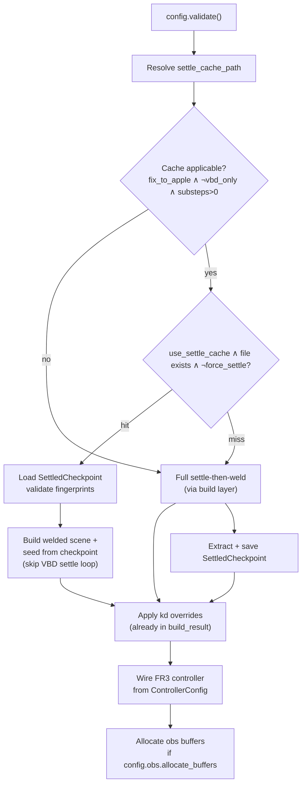

# Batched heterogeneous coupled sim runtime (V.3.1 step B)

**Status:** Implemented
**Canonical living doc:** `docs/handbook-coupled-simulation.md`
**Scope:** Runtime parent class `BatchedHeterogeneousCoupledSim`; settle disk cache; `step()` / `gather_obs()`  
**Prerequisite:** [Build layer spec (step A)](2026-07-03-batched-heterogeneous-build-design.md) — `build_batched_heterogeneous_scene()` implemented in `batched_heterogeneous_build.py`  
**Config:** [`apple_pick_sim/coupled_fruiting/batched_heterogeneous_config.py`](../../apple_pick_sim/coupled_fruiting/batched_heterogeneous_config.py)  
**Roadmap:** [`docs/ROADMAP.md`](../../ROADMAP.md) — **V.3.1**

## Goal

Wrap the step-A build layer in a library **parent/runtime class** that:

- Owns settle **disk cache** policy (load / skip / force / save)
- Wires FR3 (or placeholder) controllers from `ControllerConfig`
- Exposes `step(actions)` and `gather_obs()` for tests, gym (V.3.3), and sys-ID (V.4)
- Keeps `build_batched_heterogeneous_scene()` as the underlying primitive (unchanged public API)

Sampling (`load_ranges`, `sample_heterogeneous_params_list`) and argparse remain **caller** concerns.

## Boundaries

| Layer | Responsibility |
| ----- | -------------- |
| **Sampling** (caller) | `load_ranges` + `sample_heterogeneous_params_list`, or inject `per_env_params` via config |
| **Build** (step A, library) | Scene assembly, settle-then-weld orchestration, kd overrides → `BatchedHeterogeneousBuildResult` |
| **Settle cache** (step B, new) | Serialize/load free-proxy settled cable state + validation fingerprints |
| **Runtime sim** (step B, this spec) | `BatchedHeterogeneousCoupledSim`: cache policy, controllers, `step`, `gather_obs` |
| **Example** (V.3.2) | argparse → config, optional viewer, print diagnostics from `build_result` |
| **Gym** (V.3.3+) | `ApplePickBatchedBaseEnv` wraps this class; obs contract v3 mapping deferred |

## Public API

### Module

`apple_pick_sim/coupled_fruiting/batched_heterogeneous_coupled_sim.py`

Companion module for checkpoint I/O (recommended):

`apple_pick_sim/coupled_fruiting/settled_checkpoint.py`

### Class

```python
class BatchedHeterogeneousCoupledSim:
    def __init__(
        self,
        config: BatchedHeterogeneousCoupledSimConfig,
        per_env_params: Sequence[FruitingSystemParams],
        ranges: dict,
        *,
        viewer: Any | None = None,
        use_settle_cache: bool = True,
        force_settle: bool = False,
        settle_cache_dir: Path | str | None = None,
    ) -> None: ...

    @classmethod
    def build(cls, ...) -> BatchedHeterogeneousCoupledSim:
        """Alias to ``__init__`` — same code path."""
        ...
```

- `config.validate()` at entry.
- `ranges` passed explicitly (same contract as build layer).
- `viewer` forwarded only when settle runs (cache miss or `force_settle`); ignored on cache hit.
- `build_batched_heterogeneous_scene()` **remains** the low-level build primitive; the runtime class may call it directly or via thin wrappers that accept an optional `SettledCheckpoint`.

### Read-only surface (properties / accessors)

| Member | Type | Notes |
| ------ | ---- | ----- |
| `config` | `BatchedHeterogeneousCoupledSimConfig` | Frozen copy used at construct time |
| `scene` | `CoupledFruitingScene` | From `build_result.scene` |
| `layout` | `BatchedEnvLayout \| None` | `scene.layout` |
| `per_env_params` | `tuple[FruitingSystemParams, ...]` | Same tuple passed to build |
| `ranges` | `dict` | Topology fixture used for build |
| `build_result` | `BatchedHeterogeneousBuildResult` | Diagnostics, applied kd overrides, optional settle reports |
| `settled_checkpoint` | `SettledCheckpoint \| None` | In-memory checkpoint loaded from disk or produced during settle; `None` when cache path not applicable |
| `settle_cache_path` | `Path \| None` | Resolved filesystem path for this config/params key; `None` when caching disabled or inapplicable |
| `device` | `str` | `config.resolve_device()` |
| `frame_dt` | `float` | `config.runtime.frame_dt` |
| `sub_dt` | `float` | `config.runtime.sub_dt` |
| `num_envs` | `int` | `config.runtime.num_envs` |

No argparse, no mandatory viewer, no printing in the library class.

---

## Config extensions (`batched_heterogeneous_config.py`)

**Spec only** — implement in step B with `BatchedHeterogeneousCoupledSim`; no production code until then.

### `ControllerConfig`

Add field:

```python
action_dim: int = 6  # per-env command size (world twist: vx, vy, vz, wx, wy, wz)
```

Add methods:

```python
def expected_action_shape(self, num_envs: int) -> tuple[int, int]:
    """Return ``(num_envs, self.action_dim)``."""
    return (num_envs, self.action_dim)

def validate_actions(
    self,
    actions: torch.Tensor,
    *,
    num_envs: int,
    device: str,
    robot_step_mode: StepMode,
) -> torch.Tensor:
    """
    Validate action tensor; does **not** clip (clipping stays in ``CoupledSim.step``).

    - ``torch.Tensor``, ``float32``, on ``device``
    - Shape ``(num_envs, action_dim)`` OR ``(action_dim,)`` for broadcast to all envs
    - ``robot_step_mode == "vbd_only"`` with non-``None`` actions → ``ValueError``
    - Returns validated tensor (contiguous, on device), shape ``(num_envs, action_dim)``
    """
    ...
```

### `BatchedHeterogeneousCoupledSimConfig.validate()`

Existing cross-field checks remain. Add:

- `controller.action_dim >= 1` — raise `ValueError` otherwise
- Default `action_dim=6` matches the world-frame twist command space for all controller modes (`direct` / `ee` / `vic`); non-default values are reserved for future command spaces and are not used in step B
- No extra mode/`action_dim` coupling at validate time beyond existing `vbd_only` ↔ `controller.mode` rules; runtime rejection of non-`None` actions under `vbd_only` is enforced in `validate_actions` at `step()` time

---

## Initialization flow



### 1. Resolve settle cache path

Compute a deterministic path from a **cache key** derived from everything that must match for a checkpoint to be valid:

| Key component | Source |
| ------------- | ------ |
| Ranges identity | SHA-256 of normalized JSON bytes **or** stable stem of `ranges_path` when loaded from file (document which strategy is used; prefer content hash when `ranges` dict is passed without path) |
| `num_envs` | `config.runtime.num_envs` |
| `topology_seed` | `config.domain_randomization.topology_seed` (include `"none"` when unset) |
| Per-env material fingerprints | Sorted tuple of `params_fingerprint(p)` for each `p` in `per_env_params` |
| `settle_substeps` | `config.scene.settle_substeps` |
| Settle physics | `settle_gravity_ramp`, `settle_max_speed_m_s` |
| Settle-then-weld gate | `robot.fix_to_apple` (encoded as `fix1` / `fix0` in filename) |
| Collision flags affecting settle | `enable_self_collisions`, `enable_apple_woody_collisions`, `enable_proxy_woody_collisions` |
| Fruiting base placement | `scene.fruiting_base_pos` (normalized tuple or `"default"`) |
| Builder version | Optional `SETTLE_CACHE_SCHEMA_VERSION = 1` in metadata (bump on incompatible layout changes) |

**Filename pattern** (human-readable prefix + content hash suffix recommended):

```text
{ranges_stem}__n{num_envs}__seed{topology_seed}__sub{settle_substeps}__fix{0|1}__{params_hash8}.npz
```

Example: `fruiting_system_ranges_straight_rod_test__n4__seed42__sub5000__fix1__a3f9c2b1.npz`

**Default cache directory** (first match):

1. `settle_cache_dir` constructor argument when provided
2. Environment variable `APPLE_PICK_SIM_SETTLE_CACHE_DIR`
3. `Path.home() / ".cache" / "apple_pick_sim" / "settled"`
4. Fallback for development: `<repo_root>/.cache/settled/` (document in module docstring; do not rely on cwd)

Create parent directories on save; never fail silently on load validation mismatch.

### 2. Settle cache policy

| Flag | Behavior |
| ---- | -------- |
| `use_settle_cache=True` (default) | If applicable path exists and validates → load, skip VBD settle |
| `use_settle_cache=False` | Always run settle when build requires it; do not read cache (may still write unless disabled — see below) |
| `force_settle=True` | Run full settle even if cache exists; **overwrite** cache on success |

Precedence: `force_settle=True` overrides a cache hit. When `use_settle_cache=False`, skip read but **still write** after settle unless we add `write_settle_cache=False` later (out of scope; document as future knob if needed).

**When caching does not apply** (skip path resolution or set `settle_cache_path=None`):

- `robot.step_mode == "vbd_only"`
- `robot.fix_to_apple == False` and settle is inlined on welded scene only — cache stores **free-proxy** settled state for settle-then-weld; other paths run settle inline without persisting (same as today)
- `scene.settle_substeps == 0`

### 3. Cache hit path

1. `SettledCheckpoint.load(path)` → validate metadata fingerprints against current `config`, `ranges`, and `per_env_params`.
2. Build welded scene **without** running the free-proxy VBD loop:
   - Build free-proxy scene is **skipped**; only welded build + `seed_fix_to_apple_from_settled` using checkpoint `body_q` (and aligned `body_qd` zeros post-`quiet_all_cable_bodies`).
3. Populate `settled_checkpoint` from loaded object; `build_result` still includes scene, kd overrides; settle **diagnostics** fields remain `None` (settle did not run this session).

**Build-layer extension (implementation note):** add optional `settled_checkpoint: SettledCheckpoint | None` to a new internal entry point, e.g. `_build_with_optional_checkpoint(...)`, or extend `build_batched_heterogeneous_scene(..., settled_checkpoint=...)`. Step A function signature may gain an optional kwarg; default `None` preserves current behavior.

### 4. Cache miss path

1. Call existing `build_batched_heterogeneous_scene(config, per_env_params, ranges, viewer=viewer)` (full settle-then-weld when applicable).
2. Before/after weld, capture free-proxy settled cable `body_q` (post-`quiet_all_cable_bodies`) into `SettledCheckpoint`.
3. `SettledCheckpoint.save(settle_cache_path)`.

### 5. Robot kind resolution and warnings

Robot kind is resolved during build (see [step A `_resolve_robot_kind`](2026-07-03-batched-heterogeneous-build-design.md#robot-kind-resolution-and-warnings)). **`BatchedHeterogeneousCoupledSim` must not suppress warnings** emitted by the build layer (e.g. `warnings.filterwarnings` around `build_batched_heterogeneous_scene`).

| Case | When | Severity | Behavior |
| ---- | ---- | -------- | -------- |
| **Placeholder hot-path** | Resolved `robot_kind == "placeholder"` (explicit `config.robot.kind == "placeholder"` **or** FR3 fallback below) | `UserWarning` | Emit once at **`__init__` / `build()`** after kind is resolved (mirror `example_batched_heterogeneous_coupled_fruiting.py`). Build continues. |
| **FR3 assets missing** | `config.robot.kind == "fr3"` but `fr3_robot.fr3_assets_available()` is false | `UserWarning` | Build layer falls back to placeholder via `batched_heterogeneous_build._resolve_robot_kind`; `CoupledSim` must **not suppress** this warning. Build continues. |

**Explicit-placeholder warning (library text — match spirit of `example_batched_heterogeneous_coupled_fruiting.py`, without CLI flags):**

```python
warnings.warn(
    "Placeholder robot uses .numpy() host round-trips in step() "
    "(broadcast_joint_q_from_world0, placeholder world-0 nudge); "
    "GPU parallelism is not fully utilized. "
    "Use robot.kind='fr3' when FR3 assets are available for a fully GPU hot path.",
    UserWarning,
    stacklevel=2,
)
```

**FR3-fallback warning (owned by build layer; cross-reference only):**

```python
warnings.warn(
    "FR3 assets not found; building with placeholder TCP.",
    UserWarning,
    stacklevel=3,
)
```

These are **warnings, not errors** — construction and settle proceed. Tests that intentionally use placeholder may assert with `pytest.warns(UserWarning, match=...)`.

When FR3 is requested but assets are missing, expect **both** warnings: build-layer fallback first, then placeholder hot-path warning once resolved kind is `"placeholder"`.

### 6. Wire FR3 controller

From `config.controller` and `config.robot`:

| `controller.mode` | `robot.kind` | Controller type | Scene flags |
| ----------------- | ------------ | --------------- | ----------- |
| `direct` | `fr3` | `Fr3BatchedEEDirectJointController` | `robot_kinematic_mode = True` |
| `ee` | `fr3` | `Fr3BatchedEEVelocityController` | `robot_kinematic_mode = False` |
| `vic` | `fr3` | `Fr3BatchedEEImpedanceController` + VIC joint torque setup | `vic_use_joint_torques`, gains from `controller.vic_gains` |
| any | `placeholder` | No FR3 controller; placeholder nudge path in `step()` | — |

- Construct with `fr3_robot.batched_ik_teleop_kwargs(scene)`; raise `RuntimeError` if missing on FR3 path.
- Use `velocity_for_world` callback reading from the sim's **action buffer** (see `step()`).
- `ctrl.sync_target_from_state(scene.robot_state_0)` after attach.
- VIC: mirror example sequence (`init_mujoco_actuator_targets_from_model`, `configure_vic_joint_torques_arm_batched`, `vic.stage_targets_to_scene`).

### 7. Observation buffers

When `config.obs is not None` and `config.obs.allocate_buffers`:

```python
self._obs_bufs = make_batched_obs_buffers(layout, scene.cable, device)
```

Otherwise `_obs_bufs = None`; `gather_obs()` raises `RuntimeError` with a clear message.

### 8. Action buffer (controller)

When `config.controller.allocate_action_buffer`:

- Allocate `torch.zeros(*config.controller.expected_action_shape(num_envs), dtype=float32, device=sim_device)` (or device-resident buffer compatible with `validate_actions`).
- Persist last clipped actions for debugging / `gather_transitions` (V.4).

---

## `SettledCheckpoint` (disk format)

```python
@dataclasses.dataclass(frozen=True)
class SettledCheckpoint:
    """Free-proxy cable state after VBD settle + quiet; used to seed welded build."""

    body_q: np.ndarray          # shape (total_bodies, 7), float32 — cable model flat layout
    metadata: dict[str, Any]    # validation fingerprints (see below)

    def save(self, path: Path) -> None: ...
    @classmethod
    def load(cls, path: Path) -> SettledCheckpoint: ...
    def validate_against(
        self,
        *,
        config: BatchedHeterogeneousCoupledSimConfig,
        ranges: dict,
        per_env_params: Sequence[FruitingSystemParams],
    ) -> None: ...  # raises ValueError on mismatch
```

**Serialized `.npz` contents:**

| Array / key | Description |
| ----------- | ----------- |
| `body_q` | Settled cable `state_0.body_q` after quiet |
| `schema_version` | int |
| `cache_key` | str — canonical string of key components |
| `ranges_fingerprint` | str — hash or path stem |
| `topology_seed` | int or `-1` |
| `num_envs` | int |
| `settle_substeps` | int |
| `fix_to_apple` | bool |
| `per_env_params_fps` | JSON list of `params_fingerprint` dicts |
| `settle_gravity_ramp` | bool |
| `settle_max_speed_m_s` | float |

Load **must** reject stale files when any fingerprint differs (do not partially apply).

**Apply at seed time:** reuse `seed_fix_to_apple_from_settled(welded_scene=..., settled_scene=checkpoint_as_scene_or_body_q, quiet_apple_proxy=True, per_env_ik=True, ...)` — implementation may wrap checkpoint arrays in a minimal scene view or extend `settle_then_weld` with a `body_q=` shortcut.

---

## `step(actions)`

### Signature

```python
def step(
    self,
    actions: torch.Tensor | None = None,
) -> None:
    """Advance one control frame (``runtime.substeps_per_step`` physics substeps)."""
```

### Actions contract

| Property | Value |
| -------- | ----- |
| Type | `torch.Tensor`, `float32` |
| Device | Sim device (`self.device`) |
| Shape | `config.controller.expected_action_shape(num_envs)` — default `(num_envs, 6)` world-frame twist `[vx, vy, vz, wx, wy, wz]`; or `(action_dim,)` broadcast to all envs |
| Semantics | Linear m/s, angular rad/s, world frame (same as keyboard teleop) |

**Validation split (explicit):**

1. **`ControllerConfig.validate_actions(...)`** — shape, device, dtype, `robot_step_mode` compatibility only; **no clipping**; returns `(num_envs, action_dim)` tensor (broadcast `(action_dim,)` if needed). See [Config extensions](#config-extensions-batched_heterogeneous_configpy).
2. **`step()`** — `_clip_actions()` per-row linear magnitude to `controller.linear_speed` and angular magnitude to `controller.angular_speed`, then write clipped values to action buffer and drive controller.

### `vbd_only` policy

When `config.robot.step_mode == "vbd_only"`:

- **`actions` must be `None`.** Non-`None` actions → `ValueError` (enforced in `validate_actions` if called, or at `step()` entry before coupled path).
- Inner loop: `scene.vbd_substep(sub_dt)` × `runtime.substeps_per_step`.
- No controller advance; do not call `validate_actions` or `_clip_actions`.

### `actions=None` (coupled mode)

When `actions is None` in coupled or placeholder mode, treat as **zero world-frame twist** for all envs (synthesize zeros with `expected_action_shape`; do not read keyboard; do not reuse stale buffer unless documented otherwise for debugging).

### Coupled / placeholder stepping

Per control frame (after resolving `actions is None` → zero tensor on `self.device`):

```python
actions = config.controller.validate_actions(
    actions,
    num_envs=config.runtime.num_envs,
    device=device,
    robot_step_mode=config.robot.step_mode,
)
actions = self._clip_actions(actions)  # linear_speed / angular_speed
```

Then:

1. If FR3: run teleop frame via `scene.update_fr3_ee_teleop_direct` or `update_fr3_ee_teleop` (or VIC equivalent) using controller fed from clipped action buffer and `frame_dt`.
2. If placeholder: apply world-0 nudge from actions (env 0 linear x or full twist slice per existing example convention) and `broadcast_joint_q_from_world0`.
3. Physics: `runtime.substeps_per_step` × `scene.coupled_substep(sub_dt)`.

Increment internal `sim_time` by `frame_dt` (optional property `sim_time` for tests).

---

## `gather_obs()`

```python
def gather_obs(self) -> dict[str, torch.Tensor | wp.array]:
    """Fill obs buffers and return a snapshot dict."""
```

- Requires `self._obs_bufs is not None`.
- Calls `gather_batched_obs(bufs, scene, sub_dt, include_robot=config.obs.include_robot, include_forces=config.obs.include_forces)`.
- **Return type (v1):** `dict[str, torch.Tensor | wp.array]` with stable string keys:

| Key | Source buffer | Shape (typical) |
| --- | ------------- | --------------- |
| `apple_pos` | `bufs.apple_pos` | `(N, 3)` |
| `proxy_pos` | `bufs.proxy_pos` | `(N, 3)` |
| `tcp_pose` | `bufs.tcp_pose` | `(N, 7)` |
| `tcp_velocity` | `bufs.tcp_velocity` | `(N, 6)` |
| `tcp_force` | `bufs.tcp_force` | `(N, 6)` |
| `tcp_coupling_force` | `bufs.tcp_coupling_force` | `(N, 6)` |
| `joint_q` | `bufs.joint_q` | `(N, dof_q)` |
| `joint_qd` | `bufs.joint_qd` | `(N, dof_qd)` |
| `woody_parent_pos` | `bufs.woody_parent_pos` | `(N * J, 3)` |
| `woody_child_pos` | `bufs.woody_child_pos` | `(N * J, 3)` |
| `woody_force` | `bufs.woody_force` | `(N * J, 3)` |
| `woody_torque` | `bufs.woody_torque` | `(N * J, 3)` |

Omit force keys when `include_forces=False`; omit robot keys when `include_robot=False`.

**Gym alignment (deferred):** V.3.3 may introduce `BatchedObsSnapshot` dataclass matching obs contract v3 naming; v1 dict keeps tests and sys-ID unblocked without blocking on gym refactor.

---

## Relationship to step A build layer

| Concern | Owner |
| ------- | ----- |
| Settle loop, weld, kd | `build_batched_heterogeneous_scene()` |
| Cache policy, path, load/save | `BatchedHeterogeneousCoupledSim.__init__` |
| Optional checkpoint injection | New kwarg or helper on build module |
| Runtime stepping | `BatchedHeterogeneousCoupledSim.step` |

Do **not** remove or inline `build_batched_heterogeneous_scene()` into the class body; tests and future headless builders keep a direct build entry point.

---

## Out of scope (step B)

- Thin example refactor (**V.3.2**)
- Gym env migration (**V.3.3**)
- `BatchedHeterogeneousCoupledSimConfig.from_args()` / argparse
- CUDA graph capture wrapper
- `gather_transitions()` (**V.4.1**)
- Keyboard teleop inside the library class (examples only)

---

## Testing

### `ControllerConfig.validate_actions` (config or coupled sim tests)

Add unit tests in `apple_pick_sim/tests/test_batched_heterogeneous_config.py` **or** alongside coupled sim tests:

| Test | Intent |
| ---- | ------ |
| `test_validate_actions_wrong_shape` | e.g. `(num_envs, action_dim + 1)` or `(num_envs,)` → `ValueError` |
| `test_validate_actions_wrong_device` | CPU tensor when `device="cuda:0"` (or vice versa) → `ValueError` |
| `test_validate_actions_broadcast_action_dim` | `(action_dim,)` input → output `(num_envs, action_dim)`, contiguous on device |
| `test_validate_actions_vbd_only_rejects` | `robot_step_mode="vbd_only"`, non-`None` actions → `ValueError` |
| `test_validate_actions_action_dim_in_config_validate` | `action_dim < 1` → `BatchedHeterogeneousCoupledSimConfig.validate()` raises |

### Coupled sim integration

New module: `apple_pick_sim/tests/test_batched_heterogeneous_coupled_sim.py`

| Test | Intent |
| ---- | ------ |
| `test_init_minimal_smoke` | `test_minimal()` + injected params → `num_envs`, `layout`, scene apples above ground |
| `test_placeholder_kind_warns` | `robot.kind="placeholder"` → `pytest.warns(UserWarning, match="host round-trips")`; build succeeds |
| `test_fr3_missing_assets_warns_and_builds` | Mock/unavailable FR3 assets → fallback warning from build + placeholder performance warning; scene builds |
| `test_settle_cache_miss_then_hit` | Same key: first init settles and writes `.npz`; second init with `use_settle_cache=True` loads, no settle diagnostics, scene seeded |
| `test_force_settle_overwrites_cache` | Pre-seed cache; `force_settle=True` re-runs settle and updates file mtime / body_q hash |
| `test_use_settle_cache_false_ignores_disk` | Valid cache on disk; `use_settle_cache=False` still settles (detect via diagnostics or timing hook) |
| `test_checkpoint_validate_rejects_mismatch` | Tamper `per_env_params` or `settle_substeps` → load raises |
| `test_step_clips_speed` | Large action magnitudes → post-clip norms ≤ configured speeds |
| `test_step_vbd_only_rejects_actions` | `step_mode=vbd_only`, non-`None` actions → `ValueError` |
| `test_step_coupled_smoke` | Few `step(None)` or zero actions; apple height stable, no NaN |
| `test_gather_obs_keys` | After step, dict keys and shapes match `ObsConfig` flags |
| `test_parity_example_stepping` | Short rollout: library `step` vs example class with same config/seed — TCP/apple z within tolerance (may `@pytest.mark.slow`) |

Use isolated temp cache dir per test (`tmp_path`) to avoid cross-test pollution.

Run:

```bash
uv run --env-file pytest.env python -m pytest \
  apple_pick_sim/tests/test_batched_heterogeneous_config.py \
  apple_pick_sim/tests/test_batched_heterogeneous_coupled_sim.py -q
```

Include in ROADMAP V.3.1 validation block when implemented.

---

## Open decisions (resolved in this spec)

| Question | Decision |
| -------- | -------- |
| `vbd_only` + non-None actions | **Reject** with `ValueError` |
| `gather_obs` return type v1 | **`dict[str, Tensor \| wp.array]`** |
| Default cache dir | **`~/.cache/apple_pick_sim/settled/`** with `APPLE_PICK_SIM_SETTLE_CACHE_DIR` override |
| Clip in `validate_actions`? | **No** — clip only in `step()` via `_clip_actions()` |
| `action_dim` default | **6** — world twist; overridable on `ControllerConfig` for future command spaces |
| Keep `build_batched_heterogeneous_scene`? | **Yes**, unchanged primitive |
| Placeholder / FR3-missing robot path | **`UserWarning`**, not error; build continues; tests use `pytest.warns` |

## Self-review notes (TBDs / watch items)

1. **Ranges fingerprint:** Prefer content hash over path stem when callers pass an in-memory `ranges` dict (tests); document helper `ranges_fingerprint(ranges, ranges_path=None)`.
2. **Checkpoint without `fix_to_apple`:** Caching is explicitly disabled; if future work caches generic settle, bump `schema_version`.
3. **Build kwarg surface:** Exact name (`settled_checkpoint=` vs separate function) left to implementer; behavior is specified above.
4. **Placeholder action mapping:** Spec assumes example convention for world-0 nudge; confirm during implementation against `example_batched_heterogeneous_coupled_fruiting.py`.
5. **Torch dependency:** `step()` requires torch when coupled/placeholder path runs (including `actions=None` zero synthesis); import pattern should match VIC (`_require_torch()` or lazy import). `vbd_only` with `actions=None` stays torch-free.
6. **`action_dim` vs clip:** `_clip_actions()` assumes world-twist layout (first 3 linear, last 3 angular); document or assert `action_dim == 6` in clip path until alternate command spaces are defined.

---

## Cross-references

- [Build layer design (step A)](2026-07-03-batched-heterogeneous-build-design.md)
- [`docs/ROADMAP.md`](../../ROADMAP.md) — V.3.1 deliverable checklist
- [`batched_heterogeneous_config.py`](../../apple_pick_sim/coupled_fruiting/batched_heterogeneous_config.py)
- [`batched_heterogeneous_build.py`](../../apple_pick_sim/coupled_fruiting/batched_heterogeneous_build.py)
- [`docs/vectorized-coupled-fruiting.md`](../../vectorized-coupled-fruiting.md) — settle-then-weld flow
- [`apple_pick_sim/batched_obs.py`](../../apple_pick_sim/batched_obs.py) — `gather_batched_obs`, `BatchedObsBuffers`
- Reference example (pre–V.3.2): `apple_pick_sim/examples/example_batched_heterogeneous_coupled_fruiting.py`
