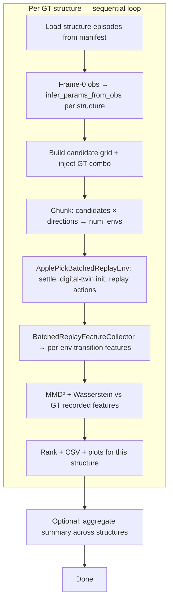

# Batched sys-ID MMD grid — design spec

**Date:** 2026-07-06  
**Branch:** `feature/batched-sysid-mmd`  
**Worktree:** `../apple_pick_sim-batched-sysid-mmd`  
**Roadmap slices:** V.4.2.1 (digital-twin replay init) + V.4.3 (in-process batched MMD)  
**Supersedes:** subprocess `apple_pick_gym/examples/run_system_identification.py` for batched datasets

## Problem

Parallel GT collection (`example_batched_collect_sysid_data.py`, `batched_sysid_v1`) is done. The next step is to replay those trajectories under many material-parameter candidates, compare replay features to the recorded GT via a distribution distance, and verify that the true parameters score best. The legacy path does this sequentially (one env build + one replay per grid point). We need the same diagnostic at batch scale on the GPU.

## Goals

1. Read `batched_sysid_v1` datasets **natively** (`BatchedSysIdDataset`) — no legacy `materialize_legacy_episode_dir` bridge.
2. For each GT **structure**, recreate fruiting geometry from **frame-0 observations only** (digital-twin path), then replay recorded EE-velocity actions under a Cartesian grid of `bend_stiffness` overrides per rod segment.
3. Batch all `(candidate × direction)` envs for one structure in a single `BatchedHeterogeneousCoupledSim` build (chunked when `num_candidates × num_directions` exceeds a cap).
4. Compute **biased MMD²** and **mean per-dimension Wasserstein-1** on hold-phase transition features (same contract as legacy `run_system_identification.py`).
5. Rank candidates, write CSV + diagnostic plots, and **assert in tests** that the injected GT stiffness combo ranks #1 under both metrics.
6. End here — **no CMA-ES / CEM** in this feature (V.5.2).

## Non-goals

- CMA-ES or any continuous optimizer.
- Cross-structure (cross-episode) batching in one Newton build — deferred fast-follow (see Deferred).
- Grid axes beyond `bend_stiffness` on `{primary, secondary, spur, stem}` (no `bend_damping` / `stretch_stiffness` axes in v1).
- Wasserstein library beyond `scipy.stats.wasserstein_distance` (no POT / sliced Wasserstein).
- Migrating legacy single-env gym envs to batched backend (V.3.4).
- Writing replay trajectories back to disk (diagnostic scores only).

## Background (existing building blocks)

| Piece | Location | Role |
|-------|----------|------|
| GT collection | `example_batched_collect_sysid_data.py`, `batched_sysid_collect.py` | Writes `batched_sysid_v1` |
| Dataset reader | `BatchedSysIdDataset` | Native v1 manifest + episode parquet |
| Structure broadcast | `sample_and_broadcast_structure_params`, `broadcast_structure_params` | Same material params across directions |
| Digital twin geometry | `digital_twin_obs_from_episode`, `infer_params_from_obs` | Frame-0 woody anchors → lengths/radii/directions |
| Single-env replay | `ApplePickReplayEnv`, `initialize_env_from_parquet` | Reference behavior |
| MMD features | `mmd_features.py`, `mmd.py` | Hold-only `[s_t, Δs_t]` transitions, RBF MMD² |
| MMD results/plots | `mmd_results.py` | CSV + ranked-loss / heatmap / sensitivity PNGs |
| Param overrides | `example_gym_replay_overrides.apply_param_overrides` | `bend_stiffness` per segment |
| Legacy grid script | `run_system_identification.py` | Sequential reference to replace |

**Topology constraint:** All structures in one collected dataset share fixed topology (`num_segments`, enabled rods, `junction_names` count) — only continuous θ and geometry differ. Heterogeneous batched build already supports this.

## Architecture



### Env indexing (within one structure)

```
env_idx = candidate_idx * num_directions + direction_idx
```

- `per_env_params = broadcast_structure_params(candidate_params_list, num_directions)` — reuse existing helper.
- Recorded actions: `(num_envs, n_frames, 6)` tensor; for each `(candidate_idx, direction_idx)`, tile that direction's recorded `action` column from `BatchedSysIdDataset.load_episode_obs_arrays(structure_idx, direction_idx)`.

### Chunking

CLI `--max-envs-per-batch` (default 32 or 64). When `n_candidates * n_directions` exceeds the cap, split **candidate groups** across chunks. Each chunk is a full batched env build + replay. Per-structure ranking merges observations from all chunks before MMD/Wasserstein.

GT candidate is always included in the grid (exact match, not nearest-neighbor) so validation is deterministic.

## New components

### 1. ApplePickBatchedReplayEnv

**Path:** `apple_pick_gym/batched_envs/apple_pick_batched_replay_env.py`

Batched analog of `ApplePickReplayEnv`, extending `ApplePickBatchedBaseEnv` or `ApplePickBatchedSysIdEnv`.

**Construction:**

- `per_env_params`: list length `num_envs` (candidates × directions).
- `recorded_actions`: `np.ndarray` shape `(num_envs, n_frames, 6)`.
- `max_episode_steps = n_frames`.
- Sim build constants aligned with `example_batched_collect_sysid_data.py` for parity.

**Behavior:**

- `reset()`: restore episode snapshot, then apply batched digital-twin init per env.
- `step(action)`: ignore passed `action`; apply `recorded_actions[env_idx, step_idx]` per env.
- `replay_numpy_obs(env_idx)` helper for the feature collector.

### 2. Batched digital-twin frame-0 init

**Path:** `apple_pick_sim/system_id/batched_digital_twin_init.py` (or extend `parquet_init.py`)

After batched settle→weld:

1. Map `env_idx → direction_idx` (structure fixed within a batch).
2. Load frame-0 from that direction's episode: `robot_joint_q`, `tcp_pos`/`tcp_quat`, weld metadata.
3. Teleport per-world robot state and VIC target using `BatchedEnvLayout` world indices.

**Params:** `infer_params_from_obs(digital_twin_obs_from_episode(...))` per structure, then `apply_param_overrides` per candidate. Capstone tests must use observation-only init, not privileged params-only reset.

### 3. BatchedReplayFeatureCollector

**Path:** extend `apple_pick_sim/system_id/mmd_features.py`

- Each step: batched obs + recorded phase/dir_idx/excitation_direction per env.
- Output: `dict[int, dict]` mapping `env_idx → arrays` for `build_transition_features_by_direction`.
- At `num_envs=1`, must match `ReplayObservationCollector` within float tolerance.

### 4. wasserstein.py

**Path:** `apple_pick_sim/system_id/wasserstein.py`

`mean_wasserstein1(x_norm, y_norm)` — mean of `scipy.stats.wasserstein_distance` across normalized feature dimensions. Same GT normalization as MMD. Per-direction scores; aggregate = mean over directions.

### 5. Distance results

Extend `mmd_results.py` with Wasserstein columns and metric-parameterized plots. Keep backward-compatible MMD-only exports.

### 6. Orchestrator script

**Path:** `apple_pick_gym/batched_examples/example_batched_sysid_mmd_grid.py`

**CLI:** `--dataset`, optional `--structure-indices`, four `--{segment}-bend-stiffness-values` grids, `--max-envs-per-batch`, `--max-candidates`, `--output`, `--metric both|mmd|wasserstein`.

**Flow per structure:** GT features from recorded parquet → infer geometry → candidate grid → chunked replay → score → rank → write `s{ii}/` outputs.

## Feature contract

Unchanged from `docs/system_identification.md` §3: hold-phase latter-half transitions `[s_t, Δs_t]`, pooled per excitation direction, aggregate = mean over directions. GT from recorded parquet; candidates from live replay.

## Error handling

- Non-v1 dataset: fail at load.
- Missing frame-0 woody: `ValueError` from digital-twin init.
- Zero valid hold transitions: skip direction with warning; fail if none remain.
- `n_frames` mismatch across directions: `ValueError`.

## Testing (TDD)

| Test | File |
|------|------|
| Capstone (GT ranks #1, both metrics) | `apple_pick_gym/tests/test_batched_sysid_mmd_grid.py` |
| Wasserstein unit | `apple_pick_sim/tests/test_wasserstein.py` |
| Collector parity at num_envs=1 | extend `test_mmd_features.py` |
| Digital-twin init smoke | extend `test_batched_sysid_replay_fidelity.py` or new |
| CLI smoke | `test_example_batched_sysid_mmd_grid_cli.py` |

## Documentation

- `docs/batched-sysid-mmd-grid.md` (user how-to).
- Update `docs/ROADMAP.md` and `docs/batched-sysid-dataset.md` on ship.

## Deferred: cross-structure batching

~20–30% extra work. Flatten env index to `(structure, candidate, direction)` and accumulate replay features per structure across chunks before ranking. Deferred because the main win is candidate × direction parallelism within a structure.

## Success criteria

1. GT `bend_stiffness` ranks #1 under MMD² and Wasserstein on synthetic batched dataset.
2. Headless end-to-end without subprocess-per-candidate builds.
3. Observation-only geometry init in capstone.
4. CSV + diagnostic PNGs per metric.
5. Fast-gate tests green.
