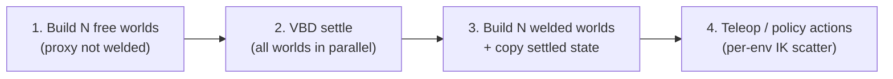

# Vectorized batched coupled fruiting

**Last updated:** 2026-07-02

**This document is the single source of truth for *how* batched coupled fruiting works** — build, settle, weld, and interactive run. It is **not** the source of truth for slice status or sequencing: that is **`docs/ROADMAP.md`** ([V] track). Where this document used to carry its own "V.1/V.2/V.3" phase table, it now points at ROADMAP instead — do not duplicate or contradict either flow in examples, README, or tests.

**Related:** arm/plant gravity split and RL training assumptions — `docs/mujoco-vbd-coupling-architecture.md` §2.5.

> **Warning — woody self-collisions are filtered (current default).** Coupled and standalone fruiting builds use `enable_self_collisions=False` unless explicitly overridden. `_apply_default_fruiting_collision_filters` in `apple_pick_sim/fruiting_system/build.py` filters **woody↔woody** self-pairs. **Apple↔woody** and **proxy↔woody** contacts default **on** (batched CLI may expose toggles). Ground contact is unchanged. Settle stability work (V.2.1.2) depends on the woody-self filter; do not re-enable woody self-contact without re-checking settle.

---

## Canonical runtime flow

Every batched coupled run follows these four steps in order.



### 1. Build batched free scene

- `num_envs = N`; cable + robot via `ModelBuilder.replicate(N, spacing=(0,0,0))` (all worlds co-located in physics).
- **`env_spacing`** is for **viewer** separation only — see [Co-located physics vs viewer spacing](#co-located-physics-vs-viewer-spacing).
- **`GripperProxyConfig(fix_to_apple=False)`** — gripper proxy is **not** welded to the apple.
- Each world is a full stack: **VBD fruiting system + MuJoCo FR3** (FR3 assets required).
- Build with **`vbd_only=True`** when this scene exists only for settling (no MuJoCo step during settle).
- Attach `BatchedEnvLayout` and `ProxyBodyRegistry` `{(tcp_w, proxy_w) for w in 0..N-1}`.

### 2. Settle all worlds in parallel

- Run **`settle_vbd_substeps(scene, substeps, dt)`** on the free batched scene (or on the built scene when not using settle-then-weld). Config knobs live on `SceneSettleCollisionConfig` / CLI (`settle_substeps`, `settle_gravity_ramp`, `settle_quiet_every`, `settle_max_speed_m_s`).
- All **N** worlds advance together on the GPU; each fruiting system relaxes under gravity with a free proxy.
- **Gravity ramp** (0 → −9.81 m/s² over settle substeps) via `gravity_ramp=True` / `--settle-gravity-ramp` — **default off** (`settle_gravity_ramp=False` in `BatchedHeterogeneousCoupledSimConfig`). Soft DR fixtures may need more substeps when the ramp is on (full g only on the final substep).
- **Quiet / zero twist:** `quiet_all_cable_bodies` / device `zero_all_body_qd_device` remove residual kinetic energy. Periodic quiet during settle defaults to every **300** VBD substeps (`SceneSettleCollisionConfig.settle_quiet_every` / `--settle-quiet-every`; `should_quiet_cable_bodies_at_settle_substep`). Pass `None` to disable. Post-settle quiet is part of a stable weld seed.
- Optional **settled-state disk cache** (`settled_checkpoint.py`, env `APPLE_PICK_SIM_SETTLE_CACHE_DIR`) when `use_settle_cache=True` (off by default; pass `--use-settle-cache` on examples).
- Diagnostics: `settle_ke_decay.py` / `log_settle_ke_decay.py`, `settle_quasi_static.py`, `sweep_settle_weld_stability.py`.
- The canonical example (`example_batched_heterogeneous_coupled_sim.py`) runs settle during build via `build_batched_heterogeneous_scene`.
- Default settle length is configurable (`--settle-substeps`; config default often 5000 for heterogeneous builds — check CLI/config, not this prose alone).

### 3. Build batched welded scene and seed from settled state

- Build a **second** batched scene with the same `N`, spacing, and topology.
- **`GripperProxyConfig(fix_to_apple=True, robot_facing_weld=True)`** — each proxy is **FIXED** to its apple (stem-harvest coupling).
- Call **`seed_fix_to_apple_from_settled(welded_scene=…, settled_scene=…)`**:
  - When both scenes have `N` worlds: copy world *i* settled cable `body_q` / `body_qd` into welded world *i*.
  - Legacy (single-world settled → `N` welded): broadcast settled state with `env_spacing` offsets.
  - Align each proxy to its apple grasp offset; zero apple/proxy twists for a quiet weld start.
  - Bootstrap FR3 IK at the fixed robot base. **Homogeneous batches** (`replicate()`, one shared seed): solve on the single-world template, copy world-0 `joint_q`, **broadcast** to all envs. **Heterogeneous batches** (`add_world`, per-env θ — shipped): per-env IK bootstrap via `BatchedTemplateIK` — each world's TCP at its own settled proxy; **no joint broadcast** on FR3.
- Topology is fixed at build time; the proxy↔apple FIXED joint cannot be toggled at runtime—hence the two-build workflow (`settle_then_weld.py`).

### 4. Run with teleop or per-env actions

- **Default controller is VIC** (`--controller vic`): `Fr3BatchedEEImpedanceController` + joint-torque impedance. Gains / joint kp/kd come from optional ranges JSON `sim_build` (see `docs/material-parameter-sampling.md`).
- Alternatives: **`--controller ee`** (`Fr3BatchedEEVelocityController`) or **`--controller direct`** (`Fr3BatchedEEDirectJointController`, kinematic IK).
- **FR3 runtime IK** (ee/direct paths) follows Newton **`example_ik_cube_stacking.py`**: `BatchedTemplateIK` on `ik_template_robot_model` with **`n_problems = N`**, per-world TCP targets, then **`scatter_to_model`** into each world's `joint_q` slice. This is **not** “solve one IK and broadcast `joint_q`.”
- **`--fr3-keyboard --viewer gl`**: the reference example feeds the **same** keyboard/scripted velocity to every env (homogeneous smoke). For **different** actions per arm, pass **`velocity_for_world=lambda w: …`** to the batched controller (see `test_batched_fr3_per_env_velocity_diverges`).
- **FR3 teleop** uses per-env IK scatter via `BatchedTemplateIK` on ee/direct; VIC integrates TCP targets and applies task wrenches as joint torques. `broadcast_joint_q_from_world0` remains for bootstrap/tests only — not the heterogeneous FR3 step path.
- Inner loop: `coupled_substep` (MuJoCo → mirror TCP→proxy+apple → VBD → stem harvest).

**Not in this flow:** `--only-vbd` / `--only-mjc`, free-proxy velocity-delta harvest as the batched default, or building welded without a prior free settle.

---

## Per-env robot actions (IK)

Newton's multi-world IK pattern (`newton/newton/examples/ik/example_ik_cube_stacking.py`) solves **`n_problems = world_count`** on a **single-world** kinematic model (`model_single` / our `ik_template_robot_model`), keeps **`joint_q_ik` shape `(N, dof)`**, and writes each row into the batched sim model's per-world slice.

| Mechanism | When | Supports different action per arm? |
| --------- | ---- | ---------------------------------- |
| **`BatchedTemplateIK.scatter_to_model`** | FR3 batched teleop / policy each frame | **Yes** — one IK row per env |
| **`broadcast_joint_q_from_world0`** | V.1 post–settle-then-weld IK bootstrap; placeholder teleop | **No** — copies world 0 to all envs (V.2 removes bootstrap broadcast on FR3) |
| Template-only IK + broadcast at runtime | **Do not use** for per-env teleop | **No** |

**Why a template robot still exists:** the batched `robot_model` stores **N disjoint worlds** in one flat `joint_q`; Newton IK FK needs a **single** contiguous articulation. The template is the IK workspace, not a settled-state copy.

**Minimal per-env teleop (FR3):**

```python
ctrl = fr3_robot.Fr3BatchedEEDirectJointController(
    scene.robot_model,
    velocity_for_world=lambda w: (
        fr3_robot.EEVelocity(linear=(0.05, 0.0, 0.0)) if w == 0 else fr3_robot.EEVelocity()
    ),
    **fr3_robot.batched_ik_teleop_kwargs(scene),
)
scene.update_fr3_ee_teleop_direct(frame_dt, ctrl)  # scatter, no broadcast
```

A batched Gym adapter is **shipped** (`ApplePickBatchedBaseEnv` / Vic / SysId — V.3.3+). Runtime `BatchedHeterogeneousCoupledSim.step(actions)` accepts device **`(N, 6)`** action tensors (coupled teleop path). Further deferred items (geometry DR on reset without rebuild, etc.) — see `docs/ROADMAP.md` [V] deferred.

---

## Behavior summary

Run **N independent coupled stacks** (VBD cable + MuJoCo FR3 per env) in one GPU step by building **homogeneous Newton worlds** with `ModelBuilder.replicate()`. After settle→weld init, the staggered two-`Model` coupling loop is unchanged (`CoupledFruitingScene.coupled_substep`: MuJoCo → mirror TCP→proxy+apple → VBD → stem harvest).

**Physics isolation:** worlds do not collide across env indices; coupling (TCP↔proxy↔apple) is **within** each env only. See [Co-located physics vs viewer spacing](#co-located-physics-vs-viewer-spacing).

### Homogeneous vs heterogeneous batches (both shipped)

| Layer | Homogeneous (`replicate()`) | Heterogeneous (`add_world`, per-env θ) |
| ----- | ------------- | ----------- |
| **Fruiting θ / geometry** | One `seed` → one `sample_params` → `replicate(N)` | Per-env seeds / numeric θ via `sample_heterogeneous_params_list` (same topology per batch) |
| **VBD settle → weld (cable)** | World *i* settled → world *i* welded ✓ | Same |
| **FR3 IK after weld** | Template solve + **`broadcast_joint_q_from_world0`** | Per-env IK row; **`scatter_to_model`** only, no broadcast |
| **Runtime actions (FR3)** | Example: same keyboard/scripted vel; IK scatter per row | **`velocity_for_world(w)`** or per-env action buffer |
| **Runtime actions (placeholder)** | World 0 nudge + broadcast every frame | Independent path drops broadcast (homogeneous smoke only) |

**What stays shared across both:** batch orchestration (`coupled_substep`), co-located sim origin, viewer grid (`--env-spacing`), homogeneous body/joint counts per batch (topology is always fixed per batch — see below).

### Batch contract

**Homogeneous builds:**

- Same enabled rod segments (`omit` set frozen).
- Same `num_segments` per rod.
- Same apple on/off.
- Same `FruitingSystemParams` across envs (identical seed / replicate).

**Heterogeneous builds (independent envs):**

- Same topology constraints as homogeneous builds (fixed `omit`, fixed segment counts — a shared `Model` requires identical body/joint counts per batch).
- **Different numeric θ per env:** `seeds: int | Sequence[int]` (e.g. `seed + w`) and/or runtime scatter of material-derived `bend_stiffness`, `stretch_stiffness`, `bend_damping` into per-world VBD arrays (sampled from \(E\), \(\zeta\); see `docs/material-parameter-sampling.md`).
- **Different actions per env** at runtime via `velocity_for_world` or action buffer → `BatchedTemplateIK.scatter_to_model`.
- **No cross-env state/command coupling** after init (except explicit homogeneous-smoke flags).

**Not yet shipped** (see `docs/ROADMAP.md` [V] track for current sequencing): geometry DR on reset without a rebuild (lengths, directions, apple radius). **Shipped:** batched `apple_pick_gym` adapter (V.3.3+); policy-scale `(N, 6)` action tensors via `BatchedHeterogeneousCoupledSim.step(actions)`.

| Use case | θ per env | Actions | Collection |
| -------- | --------- | ------- | ---------- |
| **Interactive / smoke** | Identical (homogeneous) | Same EE vel all envs (example default); IK scatter per env | Stability, IK convergence |
| **Sys-ID / CEM** | Different \(E\), \(\zeta\) (→ stiffness/damping) per env (heterogeneous) | Per-env or recorded `v_ee(t)` via scatter | Transition bags in MMD/Wasserstein feature code; in-process grid shipped (V.4.3) |
| **RL (planned)** | Domain randomization | Per-env `(N, act_dim)` from policy → scatter | Per-world obs / reward / done |
Both `replicate()` and `add_world` remain the build strategies; consumers differ in θ content, init bootstrap, action path, and gather API.

---

## Architecture

### Batched envs

```text
Cable model (world_count=N)          Robot model (world_count=N)
  world 0: tree + proxy                  world 0: FR3 + tcp_0
  world 1: tree + proxy                  world 1: FR3 + tcp_1
  ...                                    ...
  world N-1: ...                         world N-1: ...

Registry: {(tcp_w, proxy_w) for w in 0..N-1}
```

**Unchanged from M1:**

- Two separate `newton.Model` objects (cable VBD + robot MuJoCo).
- `ProxyBodyRegistry`; mirror and stem harvest launch with `dim = len(registry)`.
- No merge into one model; lagged wrench semantics unchanged.

**Batched extensions:**

| Component | Role |
| --------- | ---- |
| `builders.py` / `batched_build.py` | Template + `replicate(N)`; free vs welded `GripperProxyConfig` |
| `batched_layout.py` | World → tcp, proxy, apple, joint slices |
| `settle_then_weld.py` | `settle_vbd_substeps`, `seed_fix_to_apple_from_settled` |
| `broadcast_actions.py` | World-0 `joint_q` broadcast (bootstrap + placeholder only) |
| `apply_wrench.py` | Registry-based multi-TCP `body_f` write |
| `batched_template_ik.py` | Cube-stacking IK: `n_problems=N`, per-row scatter to batched model |
| MuJoCo | `separate_worlds=True` when `N > 1` |

**Out of scope for one batch:** varying `num_segments` or `omit` within a batch (heterogeneous body counts).

### Heterogeneous builds (V.2.1 + V.2.2 — build-time DR)

When continuous parameters differ per env but **topology stays uniform** (same `num_segments`, same enabled segments), use `ModelBuilder.add_world` instead of `replicate()`:

- `sample_heterogeneous_params_list(ranges, topology_seed, num_envs)` — fixes `num_segments` from `topology_seed`, samples continuous θ per env.
- `build_heterogeneous_coupled_cable_scene(params_list, …)` — one `add_world` per params entry; co-located physics (`spacing` identity); stiffness/mass/geometry baked at `finalize()`.
- `build_heterogeneous_coupled_fruiting_{placeholder,fr3}(ranges, params_list, …)` — full coupled stack + `BatchedEnvLayout`.
- Settle→weld: `seed_fix_to_apple_from_settled(..., per_env_ik=True, per_world_proxy_offsets=…)` — per-env robot-facing weld offset and per-env IK bootstrap (no FR3 `joint_q` broadcast).
- Per-env weld direction: computed at welded build from each env's stem geometry + shared `robot_base_pos` (`robot_facing_weld=True`); no extra sampler.

Reference example (default `--fix-to-apple` on):

```bash
uv run python apple_pick_sim/examples/example_batched_heterogeneous_coupled_sim.py \
  --num-envs 4 --viewer gl --seed 42 --mark-endpoints --tcp-force-arrow

# Per-env action scatter demo (RL prep)
uv run python apple_pick_sim/examples/example_batched_heterogeneous_coupled_sim.py \
  --num-envs 4 --viewer gl --demo-per-env-actions --seed 42
```

Tests: `apple_pick_sim/tests/test_heterogeneous_coupled_fruiting.py`.

Runtime stepping remains vectorized: `settle_vbd_substeps`, `coupled_substep`, and `BatchedTemplateIK.scatter_to_model` are unchanged.

**Vectorization status (heterogeneous):** the two original P0 gaps are **fixed** — batched stem harvest (`harvest_batched_stem_tension`) and per-env grasp offsets / apple mass (`prepare_batched_stem_harvest_arrays`). Co-teleport / explicit-load flag arrays are cached at build (no per-substep realloc). See [`heterogeneous-batched-vectorization-audit.md`](heterogeneous-batched-vectorization-audit.md).

**Config note:** `FruitingSystemConfig.stem_harvest_explicit_apple_weight` is currently **inert** — builders resolve explicit apple load to `True` when welded regardless of this field. Do not treat the config flag as a functional override.

---

In batched coupled runs (`example_batched_heterogeneous_coupled_sim.py`), all **N** worlds occupy the **same physical coordinates** in simulation, but the Newton GL / Viser viewer arranges them in a **grid** so they are easy to inspect. This is intentional and matches Newton’s multi-world guidance ([`newton/docs/concepts/worlds.rst`](../newton/docs/concepts/worlds.rst), `ModelBuilder.replicate` / `add_world` docstrings).

#### Physics build (co-located)

Both the VBD cable model and the MuJoCo robot model are replicated with **zero physical spacing**:

```python
outer.replicate(tpl_builder, num_envs, spacing=(0.0, 0.0, 0.0))
```

Implementation: `apple_pick_sim/coupled_fruiting/batched_build.py` (`build_replicated_coupled_cable_scene`, `build_replicated_robot_model`).

The `env_spacing` argument passed into the builders is stored on `CoupledFruitingScene.env_spacing` for visualization and legacy settle broadcast; it is **not** applied as `replicate()` spacing on the robot, and the cable replicate always uses `(0, 0, 0)`.

`BatchedEnvLayout` is built with `env_spacing=(0, 0, 0)` — layout indices and sim-frame positions refer to the co-located model, not the viewer grid.

#### Viewer grid (visual only)

When `num_envs > 1` and the viewer is graphical, the example calls:

```python
viewer.set_world_offsets(env_spacing)  # default: (2.5, 2.5, 0)
```

This shifts each world’s **rendered** geometry along a grid computed by `newton.utils.compute_world_offsets`. It does **not** change `body_q`, `joint_q`, or collision geometry in the sim.

CLI: `--env-spacing X Y Z` (default `2.5 2.5 0`).

Debug overlays in `apple_pick_sim/batched_viz.py` add the same per-world viewer offset when drawing TCP force arrows and endpoint markers so annotations line up with the spaced-out GL view.

#### Why co-location is correct

| Concern | How it is handled |
| ------- | ----------------- |
| **Cross-env collisions** | Newton assigns each replicated body a **world index**. Collision broad-phase rejects pairs from different worlds (except global entities such as a shared ground plane). Overlapping geometry in space does not cause cross-talk. |
| **MuJoCo isolation** | `separate_worlds=True` when `N > 1`: each env is an independent MuJoCo instance; no inter-world contacts. |
| **Cable ↔ robot coupling** | TCP→proxy mirror and stem harvest assume cable and robot bodies for world *w* share the same sim frame. Physical spacing on one model but not the other would break coupling. |
| **Numerical stability** | Newton recommends keeping replicated worlds at the origin in physics and using viewer offsets for display — large physical offsets can reduce stability. |

#### What to expect (common confusion)

| Surface | Coordinate frame |
| ------- | ---------------- |
| **Sim state** (`body_q`, status prints, `test_final`) | Co-located — all envs share the same world origin unless per-env IK/actions have diverged |
| **Newton GL / Viser viewer** | Grid-separated via `set_world_offsets` |
| **`--mujoco-viewer` passive window** | Sim coordinates — arms may appear stacked; this viewer does not apply `set_world_offsets` |
| **Legacy 1→N settle broadcast** | `broadcast_settled_cable_state_to_batched_worlds` may add physical `env_spacing` shifts when copying a **single-world** settled scene into **N** welded worlds; the canonical path copies settled world *i* → welded world *i* with no spacing offset |

#### Do not

- Apply **different** physical `replicate(..., spacing=…)` on cable vs robot — coupling requires aligned frames per world.
- Treat **`--env-spacing`** as a sim parameter for RL/sys-id — it affects visualization (and the legacy broadcast path only), not independent env geometry in the canonical build.

---

## Sim-to-real and RL training contract

Batched coupled fruiting is the intended backend for **parallel RL** (planned, see `docs/ROADMAP.md`) and build-time **domain randomization** (shipped heterogeneous builds). The sim assumes the same control contract as the target real stack:

| Assumption | Simulation | Real robot (target) |
|------------|------------|---------------------|
| Arm link gravity | **Off** on Model A (`robot_model.gravity = 0`) | Gravity compensation from arm model only (**zero payload** in feedforward) |
| Apple / stem load | **On** via VBD + lagged TCP harvest (`body_f`); explicit `-m_apple · g` when welded | Unmodeled external wrench at EE after grasp (not in gravity-comp feedforward) |
| Policy objective | Learn reactions to **DR apples** (mass, stiffness, geometry) | Same — comp does not hide variable fruit weight |

**Training checklist** (full detail: `docs/mujoco-vbd-coupling-architecture.md` §2.5):

1. **Dynamic arm** — `robot_kinematic_mode=False` for post-grasp pull/twist; kinematic Gym smoke (M2.1) does not exercise payload.
2. **Settle → weld** — canonical batched flow (§ Canonical runtime flow); per-env `sample_heterogeneous_params_list` for build-time DR (`example_batched_heterogeneous_coupled_sim.py` / `BatchedHeterogeneousCoupledSim`).
3. **Randomize plant θ, not arm gravity** — vary `apple_mass_kg` / density / stem stiffness per env; keep Model A at zero-g; do not add apple mass to real gravity-comp feedforward while training for payload robustness.
4. **Observations** — TCP wrench and related load cues in `apple_pick_gym` (see `docs/gym-observation-contract.md`).

**Do not** treat perfect gravity compensation with the true apple mass as the training default — that hides the variable-payload problem the policy should learn.

---

## θ application

| Parameter class | Sys-ID (shipped) | RL (planned) | When to apply |
| --------------- | ------------ | -------- | ------------- |
| `youngs_modulus_pa`, `damping_ratio` → derived `bend_stiffness`, `stretch_stiffness`, `bend_damping` | Primary CEM targets | DR | **Build-time** (shipped) or **runtime scatter** into VBD arrays per world |
| `length`, `radius`, `direction` | Usually fixed (twin) | DR | **Reset-time** kinematics per world (planned, needs rebuild-free reset support) |
| Apple `radius`, `density` | Optional | **DR (primary)** | Build or reset per policy (planned); scales `apple_mass_kg` → explicit harvest wrench when welded |

Per-env sampling uses `sample_params(ranges, seed_w)` with distinct seeds; topology (`omit`, segment counts) stays fixed per batch. Material keys and derivation: `docs/material-parameter-sampling.md`. Status/sequencing for the "planned" rows: `docs/ROADMAP.md`.

---

## Status and sequencing

Everything described above (homogeneous `replicate()` batches, heterogeneous `add_world` batches, per-env IK bootstrap, material-parameter sampling, build-time θ domain randomization, per-env runtime actions) is **shipped**. This document intentionally does not keep its own phase/slice table — the previous version's "V.1/V.2.x/V.3.x" table drifted out of sync with, and used different slice numbers than, the canonical one.

For **current status, active slice, and what's next** (sim API extraction, batched gym migration, batched sys-ID, geometry DR on reset, policy-scale action tensors, batched VIC), see the **`[V]` track in `docs/ROADMAP.md`** — that is the single source of truth for sequencing.

Deferred (tracked in `docs/ROADMAP.md` backlog, not here): batched VIC as the default gym controller, heterogeneous topology within one batch.

---

## Batched heterogeneous sim config and runtime (V.3.1)

Library build settings and runtime for `BatchedHeterogeneousCoupledSim` live under
`apple_pick_sim/coupled_fruiting/`. The root config type
`BatchedHeterogeneousCoupledSimConfig` composes:

| Sub-config | Role |
| ---------- | ---- |
| `RuntimeConfig` | `num_envs`, `env_spacing`, device, `control_hz`, `sub_dt` |
| `RobotConfig` | FR3-only (`kind="fr3"`), `fix_to_apple`, gripper proxy, IK bootstrap |
| `SceneSettleCollisionConfig` | Fruiting base, settle substeps, AVBD collision flags |
| `DomainRandomizationConfig` | Ranges fixture, topology seed, optional `per_env_params` inject |
| `FruitingSystemConfig` | Stem harvest caps, joint angular kd overrides |
| `ControllerConfig` | direct / ee / vic teleop and VIC gains |
| `MujocoConfig` | MuJoCo solver kwargs |
| `SettleDiagnosticsConfig` | Optional KE decay reporting (examples/CI) |
| `ObsConfig` | Optional batched obs buffer allocation (gym default on) |

Presets: `defaults()` (heterogeneous example), `gym_defaults(num_envs)`, `test_minimal(num_envs)`.
Call `validate()` before build. Runtime: `BatchedHeterogeneousCoupledSim.build()` → `step(actions)` → `gather_obs()`.
Settled-state cache: `settled_checkpoint.py`. Tests: `test_batched_heterogeneous_config.py`, `test_batched_heterogeneous_build.py`, `test_batched_heterogeneous_coupled_sim.py`.

---

## Code map

| Module | Role |
| ------ | ---- |
| `apple_pick_sim/coupled_fruiting/builders.py` | `num_envs`, `env_spacing`, replicate pipeline |
| `apple_pick_sim/coupled_fruiting/batched_heterogeneous_config.py` | Frozen config dataclasses for batched heterogeneous sim (V.3.1) |
| `apple_pick_sim/coupled_fruiting/batched_heterogeneous_build.py` | Config-driven heterogeneous build orchestration; `print_per_env_params` |
| `apple_pick_sim/coupled_fruiting/batched_heterogeneous_coupled_sim.py` | `BatchedHeterogeneousCoupledSim` runtime API (V.3.1) |
| `apple_pick_sim/coupled_fruiting/settled_checkpoint.py` | Deterministic settle cache load/save/validate |
| `apple_pick_sim/coupled_fruiting/batched_build.py` | `replicate(N)` + `eval_fk`; legacy 1→N settled broadcast |
| `apple_pick_sim/coupled_fruiting/batched_layout.py` | `BatchedEnvLayout` |
| `apple_pick_sim/coupled_fruiting/settle_then_weld.py` | Settle + seed + IK bootstrap |
| `apple_pick_sim/coupled_fruiting/broadcast_actions.py` | World-0 joint broadcast |
| `apple_pick_sim/coupled_fruiting/apply_wrench.py` | Multi-TCP wrench apply |
| `apple_pick_sim/coupled_fruiting/scene.py` | `coupled_substep` ordering |
| `apple_pick_sim/robot/fr3_robot/batched_template_ik.py` | Batched template IK |
| `apple_pick_sim/robot/fr3_robot/controllers/*_batched.py` | Batched teleop controllers |
| `apple_pick_sim/examples/example_batched_heterogeneous_coupled_sim.py` | Canonical batched heterogeneous entry point (thin CLI + `BatchedHeterogeneousCoupledSim`) |

---

## Tests

Module: `apple_pick_sim/tests/test_batched_heterogeneous_config.py` — config presets, validation, timing helpers.

Module: `apple_pick_sim/tests/test_batched_heterogeneous_build.py` — config-driven build orchestration.

Module: `apple_pick_sim/tests/test_batched_heterogeneous_coupled_sim.py` — runtime API, settle cache, FR3 per-env actions.

Module: `apple_pick_sim/tests/test_vectorized_coupled_fruiting.py`

| Test | Intent |
| ---- | ------ |
| `test_build_num_envs_smoke` | `num_envs=4`; `world_count==4`; registry len 4 |
| `test_world0_parity_single_env` | World-0 poses match single-env build (same seed) |
| `test_coupled_substep_multi_env_stable` | Substeps; all apples above ground |
| `test_broadcast_joint_q_copies_all_worlds` | All joint slices equal world 0 after broadcast |
| `test_apply_wrench_all_registry_tcps` | Wrenches on every TCP `body_f` slot |
| `test_build_batched_fr3_smoke` | FR3 batched build; `world_count == num_envs` |
| `test_parallel_free_settle_runs_on_all_worlds` | Parallel VBD settle moves apples in every world |
| `test_parallel_settle_then_weld_seeds_each_world_apple` | Welded scene copies per-world settled apple pose |
| `test_parallel_welded_quiet_proxy_offset_per_world` | Proxy grasp offset per world after settle→weld |
| `test_parallel_welded_ik_bootstrap_aligns_world0_tcp` | Template IK bootstrap; template TCP at proxy |
| `test_parallel_welded_ik_bootstrap_aligns_batched_tcp` | Batched world-0 TCP at proxy after bootstrap |
| `test_batched_fr3_fix_to_apple_teleop_all_worlds_converge` | Batched IK converges all worlds after weld |
| `test_batched_fr3_fix_to_apple_substep_stable` | Welded batched substeps stay stable |
| `test_batched_fr3_per_env_velocity_diverges` | `velocity_for_world(w)` diverges integrated targets |

**Covered under other names** (heterogeneous suite — do not reimplement):

| Test | Intent |
| ---- | ------ |
| `test_batched_ik_bootstrap_aligns_all_proxy_targets` | Every env's TCP at its own proxy after bootstrap (no broadcast) |
| `test_per_env_ik_produces_different_joint_q` | Distinct grasp targets → distinct `joint_q` slices post-weld |
| *(deferred)* runtime stiffness scatter | Per-world K/B re-scatter without rebuild — ROADMAP [V] deferred |

Fast unit tests: `apple_pick_sim/tests/test_batched_template_ik.py`.

Heterogeneous build / per-env weld: `apple_pick_sim/tests/test_heterogeneous_coupled_fruiting.py`.

Viewer offset alignment: `apple_pick_sim/tests/test_batched_viz.py` (`test_world_position_uses_scene_env_spacing_over_layout`, endpoint / force-arrow placement).

---

## How to verify

```bash
# Fast batched-template IK unit tests
uv run --env-file pytest.env python -m pytest \
  apple_pick_sim/tests/test_batched_template_ik.py -q

# Fast vectorization tests
uv run --env-file pytest.env python -m pytest \
  apple_pick_sim/tests/test_vectorized_coupled_fruiting.py -q

# Headless multi-env smoke (settle→weld)
uv run python apple_pick_sim/examples/example_batched_heterogeneous_coupled_sim.py \
  --viewer null --num-frames 200 --num-envs 4 --settle-substeps 100 --seed 42

# Interactive keyboard teleop (default --controller vic)
uv run python apple_pick_sim/examples/example_batched_heterogeneous_coupled_sim.py \
  --num-envs 4 --env-spacing 2.0 2.0 2.0 \
  --fr3-keyboard --viewer gl --seed 42

# Heterogeneous batched tests (build-time DR; default settle→weld)
uv run --env-file pytest.env python -m pytest \
  apple_pick_sim/tests/test_heterogeneous_coupled_fruiting.py -q
uv run python apple_pick_sim/examples/example_batched_heterogeneous_coupled_sim.py \
  --viewer null --num-frames 200 --num-envs 4 --settle-substeps 100 --seed 42
```

Existing coupled gates remain required:

```bash
uv run --env-file pytest.env python -m pytest apple_pick_sim/tests/ -q -m "not slow"
uv run python apple_pick_sim/examples/example_coupled_fruiting.py --viewer null --num-frames 60
```

---

## Risks

| Risk | Mitigation |
| ---- | ---------- |
| FR3 + `replicate` + MuJoCo validation | Fast tests use FR3 helpers (`conftest.py`); placeholder builders removed |
| `separate_worlds` on CPU pytest | `separate_worlds=True` when `num_envs > 1` |
| IK / settle drift across worlds | Per-world settled copy; co-located replicate; V.2 per-env IK bootstrap; runtime per-env IK scatter |
| Per-env actions vs broadcast confusion | FR3 teleop uses `BatchedTemplateIK.scatter_to_model`; `broadcast_joint_q_from_world0` is homogeneous bootstrap / placeholder only — not used on the heterogeneous FR3 path |
| CMA-ES wants fast θ sweeps | Per-env K/B scatter is shipped (build-time); recorded-action replay + MSE/Wasserstein grid shipped (V.4.3); V.5.1–V.5.2 Done; Current focus **V.5.3** held-out sim-sim validation — see `docs/ROADMAP.md` |
