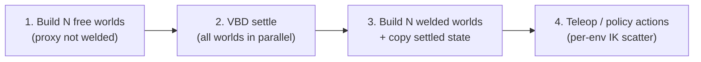

# Vectorized batched coupled fruiting

**Last updated:** 2026-06-25

**This document is the single source of truth** for batched coupled fruiting: build, settle, weld, and interactive run. Do not duplicate or contradict this flow in examples, README, or tests—link here instead.

---

## Canonical runtime flow

Every batched coupled run follows these four steps in order.



### 1. Build batched free scene

- `num_envs = N`; cable + robot via `ModelBuilder.replicate(N, spacing=(0,0,0))` (all worlds co-located in physics).
- **`env_spacing`** is for **viewer** separation only (`viewer.set_world_offsets`); do not use physical spacing on cable vs robot separately.
- **`GripperProxyConfig(fix_to_apple=False)`** — gripper proxy is **not** welded to the apple.
- Each world is a full stack: **VBD fruiting system + MuJoCo FR3** (or placeholder TCP for smoke).
- Build with **`vbd_only=True`** when this scene exists only for settling (no MuJoCo step during settle).
- Attach `BatchedEnvLayout` and `ProxyBodyRegistry` `{(tcp_w, proxy_w) for w in 0..N-1}`.

### 2. Settle all worlds in parallel

- Run **`settle_vbd_substeps(scene, substeps, dt)`** on the free batched scene.
- All **N** worlds advance together on the GPU; each fruiting system relaxes under gravity with a free proxy.
- Default settle length matches single-env coupled fruiting (`--settle-substeps`, typically 1000).

### 3. Build batched welded scene and seed from settled state

- Build a **second** batched scene with the same `N`, spacing, and topology.
- **`GripperProxyConfig(fix_to_apple=True, robot_facing_weld=True)`** — each proxy is **FIXED** to its apple (stem-harvest coupling).
- Call **`seed_fix_to_apple_from_settled(welded_scene=…, settled_scene=…)`**:
  - When both scenes have `N` worlds: copy world *i* settled cable `body_q` / `body_qd` into welded world *i*.
  - Legacy (single-world settled → `N` welded): broadcast settled state with `env_spacing` offsets.
  - Align each proxy to its apple grasp offset; zero apple/proxy twists for a quiet weld start.
  - Bootstrap FR3 IK at the fixed robot base (single-world template model for `N > 1`); copy solved world-0 `joint_q` into the batched model and **broadcast** once so all arms start at the same quiet pose.
- Topology is fixed at build time; the proxy↔apple FIXED joint cannot be toggled at runtime—hence the two-build workflow (`settle_then_weld.py`).

### 4. Run with teleop or per-env actions

- **`Fr3BatchedEEDirectJointController`** or **`Fr3BatchedEEVelocityController`** (`--controller direct` or `ee`).
- **FR3 runtime IK** follows Newton **`example_ik_cube_stacking.py`**: `BatchedTemplateIK` on `ik_template_robot_model` with **`n_problems = N`**, per-world TCP targets, then **`scatter_to_model`** into each world's `joint_q` slice. This is **not** “solve one IK and broadcast `joint_q`.”
- **`--fr3-keyboard --viewer gl`**: the reference example feeds the **same** keyboard/scripted velocity to every env (homogeneous smoke). For **different** actions per arm, pass **`velocity_for_world=lambda w: …`** to the batched controller (see `test_batched_fr3_per_env_velocity_diverges`).
- **Placeholder TCP** (`--robot placeholder`) still nudges world 0 and calls **`broadcast_joint_q_from_world0`** each frame — homogeneous only.
- Inner loop: `coupled_substep` (MuJoCo → mirror TCP→proxy+apple → VBD → stem harvest).

**Not in this flow:** batched VIC, `--only-vbd` / `--only-mjc`, free-proxy velocity-delta harvest as the batched default, or building welded without a prior free settle.

---

## Per-env robot actions (IK)

Newton's multi-world IK pattern (`newton/newton/examples/ik/example_ik_cube_stacking.py`) solves **`n_problems = world_count`** on a **single-world** kinematic model (`model_single` / our `ik_template_robot_model`), keeps **`joint_q_ik` shape `(N, dof)`**, and writes each row into the batched sim model's per-world slice.

| Mechanism | When | Supports different action per arm? |
| --------- | ---- | ---------------------------------- |
| **`BatchedTemplateIK.scatter_to_model`** | FR3 batched teleop / policy each frame | **Yes** — one IK row per env |
| **`broadcast_joint_q_from_world0`** | Post–settle-then-weld IK bootstrap; placeholder teleop | **No** — copies world 0 to all envs |
| Template-only IK + broadcast at runtime | **Do not use** for per-env teleop | **No** |

**Why a template robot still exists:** the batched `robot_model` stores **N disjoint worlds** in one flat `joint_q`; Newton IK FK needs a **single** contiguous articulation. The template is the IK workspace, not a settled-state copy.

**Minimal per-env teleop (FR3):**

```python
ctrl = fr3_robot.Fr3BatchedEEDirectJointController(
    scene.robot_model,
    velocity_for_world=lambda w: (
        fr3_robot.EEVelocity(linear=(0.05, 0.0, 0.0)) if w == 0 else fr3_robot.EEVelocity()
    ),
    **fr3_robot.batched_ik_teleop_kwargs(scene),
)
scene.update_fr3_ee_teleop_direct(frame_dt, ctrl)  # scatter, no broadcast
```

Gym / RL **(planned, V.3)** will pass **`(N, act_dim)`** policy outputs into the same scatter path instead of `velocity_for_world`.

---

## Behavior summary

Run **N independent coupled stacks** (VBD cable + MuJoCo FR3 per env) in one GPU step by building **homogeneous Newton worlds** with `ModelBuilder.replicate()`. After the canonical settle→weld init above, the staggered two-`Model` coupling loop is unchanged (`CoupledFruitingScene.coupled_substep`: MuJoCo → mirror TCP→proxy+apple → VBD → stem harvest).

**Batch contract (V.1 — homogeneous builds):**

- Same enabled rod segments (`omit` set frozen).
- Same `num_segments` per rod.
- Same apple on/off.
- Same `FruitingSystemParams` across envs (identical seed / replicate).

**(Planned, V.2+)** Only **numeric** `FruitingSystemParams` fields will vary per env (stiffness, damping, lengths, directions, apple radius/density). No padded topology or heterogeneous body counts.

| Use case | θ per env | Actions | Collection |
| -------- | --------- | ------- | ---------- |
| **Interactive / smoke** | Identical (V.1) | Same EE vel all envs (example default); IK **scatter** per env | Stability, IK convergence |
| **Per-arm teleop / policies** | Identical or DR | **`velocity_for_world(w)`** or `(N, act_dim)` → `BatchedTemplateIK` scatter | Per-env TCP motion |
| **System identification** | Different stiffness/damping | Same or per-env recorded `v_ee(t)` via scatter | Per-world transitions for MMD / CEM |
| **RL training** | Domain randomization | Per-env `(N, act_dim)` from policy → scatter | Per-world obs / reward / done |

`replicate()` is the same build strategy for all consumers; sys-id vs RL differs in θ content, action path, and gather API—not in the canonical init flow.

---

## Architecture

### Batched envs

```text
Cable model (world_count=N)          Robot model (world_count=N)
  world 0: tree + proxy                  world 0: FR3 + tcp_0
  world 1: tree + proxy                  world 1: FR3 + tcp_1
  ...                                    ...
  world N-1: ...                         world N-1: ...

Registry: {(tcp_w, proxy_w) for w in 0..N-1}
```

**Unchanged from M1:**

- Two separate `newton.Model` objects (cable VBD + robot MuJoCo).
- `ProxyBodyRegistry`; mirror and stem harvest launch with `dim = len(registry)`.
- No merge into one model; lagged wrench semantics unchanged.

**Batched extensions:**

| Component | Role |
| --------- | ---- |
| `builders.py` / `batched_build.py` | Template + `replicate(N)`; free vs welded `GripperProxyConfig` |
| `batched_layout.py` | World → tcp, proxy, apple, joint slices |
| `settle_then_weld.py` | `settle_vbd_substeps`, `seed_fix_to_apple_from_settled` |
| `broadcast_actions.py` | World-0 `joint_q` broadcast (bootstrap + placeholder only) |
| `apply_wrench.py` | Registry-based multi-TCP `body_f` write |
| `batched_template_ik.py` | Cube-stacking IK: `n_problems=N`, per-row scatter to batched model |
| MuJoCo | `separate_worlds=True` when `N > 1` |

**Out of scope for one batch:** varying `num_segments` or `omit` within a batch (heterogeneous body counts).

---

## θ application (post-init) *(planned, V.2+)*

| Parameter class | Sys-ID | RL | When to apply |
| --------------- | ------ | -- | ------------- |
| `bend_stiffness`, `stretch_stiffness`, `bend_damping` | Primary CEM targets | DR | **Runtime scatter** into VBD joint/material arrays |
| `length`, `radius`, `direction` | Usually fixed (twin) | DR | **Reset-time** kinematics per world |
| Apple `radius`, `density` | Optional | Optional | Build or reset per policy |

---

## Phased delivery

| Slice | Deliverable | Unblocks |
| ----- | ----------- | -------- |
| **V.1** *(current)* | Canonical settle→weld batched init; `BatchedTemplateIK` scatter teleop; homogeneous example keyboard; tests | Batched interactive smoke |
| **V.2** *(planned)* | Per-env K/B scatter; recorded-action replay; `gather_transitions()` for MMD | M3.2 CEM without subprocess grid |
| **V.3** *(planned)* | Per-env geometry DR on reset; batched gym adapter wiring `(N, act_dim)` → scatter | M2 RL training |

Deferred: batched VIC, heterogeneous topology within one batch.

---

## Code map

| Module | Role |
| ------ | ---- |
| `apple_pick_sim/coupled_fruiting/builders.py` | `num_envs`, `env_spacing`, replicate pipeline |
| `apple_pick_sim/coupled_fruiting/batched_build.py` | `replicate(N)` + `eval_fk`; legacy 1→N settled broadcast |
| `apple_pick_sim/coupled_fruiting/batched_layout.py` | `BatchedEnvLayout` |
| `apple_pick_sim/coupled_fruiting/settle_then_weld.py` | Settle + seed + IK bootstrap |
| `apple_pick_sim/coupled_fruiting/broadcast_actions.py` | World-0 joint broadcast |
| `apple_pick_sim/coupled_fruiting/apply_wrench.py` | Multi-TCP wrench apply |
| `apple_pick_sim/coupled_fruiting/scene.py` | `coupled_substep` ordering |
| `apple_pick_sim/robot/fr3_robot/batched_template_ik.py` | Batched template IK |
| `apple_pick_sim/robot/fr3_robot/controllers/*_batched.py` | Batched teleop controllers |
| `apple_pick_sim/examples/example_batched_coupled_fruiting.py` | Reference implementation of the canonical flow |

---

## Tests

Module: `apple_pick_sim/tests/test_vectorized_coupled_fruiting.py`

| Test | Intent |
| ---- | ------ |
| `test_build_num_envs_smoke` | `num_envs=4`; `world_count==4`; registry len 4 |
| `test_world0_parity_single_env` | World-0 poses match single-env build (same seed) |
| `test_coupled_substep_multi_env_stable` | Substeps; all apples above ground |
| `test_broadcast_joint_q_copies_all_worlds` | All joint slices equal world 0 after broadcast |
| `test_apply_wrench_all_registry_tcps` | Wrenches on every TCP `body_f` slot |
| `test_build_batched_fr3_smoke` | FR3 batched build; `world_count == num_envs` |
| `test_parallel_free_settle_runs_on_all_worlds` | Parallel VBD settle moves apples in every world |
| `test_parallel_settle_then_weld_seeds_each_world_apple` | Welded scene copies per-world settled apple pose |
| `test_parallel_welded_quiet_proxy_offset_per_world` | Proxy grasp offset per world after settle→weld |
| `test_parallel_welded_ik_bootstrap_aligns_world0_tcp` | Template IK bootstrap; template TCP at proxy |
| `test_parallel_welded_ik_bootstrap_aligns_batched_tcp` | Batched world-0 TCP at proxy after bootstrap |
| `test_batched_fr3_fix_to_apple_teleop_all_worlds_converge` | Batched IK converges all worlds after weld |
| `test_batched_fr3_fix_to_apple_substep_stable` | Welded batched substeps stay stable |
| `test_batched_fr3_per_env_velocity_diverges` | `velocity_for_world(w)` diverges integrated targets |

Fast unit tests: `apple_pick_sim/tests/test_batched_template_ik.py`.

---

## How to verify

```bash
# Fast batched-template IK unit tests
uv run --env-file pytest.env python -m pytest \
  apple_pick_sim/tests/test_batched_template_ik.py -q

# Fast vectorization tests
uv run --env-file pytest.env python -m pytest \
  apple_pick_sim/tests/test_vectorized_coupled_fruiting.py -q

# Headless multi-env smoke (settle→weld)
uv run python apple_pick_sim/examples/example_batched_coupled_fruiting.py \
  --viewer null --num-frames 500 --num-envs 4 --fix-to-apple --controller direct --seed 42

# Interactive keyboard teleop (canonical flow)
uv run python apple_pick_sim/examples/example_batched_coupled_fruiting.py \
  --num-envs 4 --env-spacing 2.5 2.5 0 --fix-to-apple --controller direct \
  --fr3-keyboard --viewer gl --seed 42

# Fast robot for CI
uv run python apple_pick_sim/examples/example_batched_coupled_fruiting.py \
  --viewer null --num-frames 120 --robot placeholder --num-envs 2 --fix-to-apple
```

Existing coupled gates remain required:

```bash
uv run --env-file pytest.env python -m pytest apple_pick_sim/tests/ -q -m "not slow"
uv run python apple_pick_sim/examples/example_coupled_fruiting.py --viewer null --num-frames 60
```

---

## Risks

| Risk | Mitigation |
| ---- | ---------- |
| FR3 + `replicate` + MuJoCo validation | Placeholder TCP in fast tests; FR3 smoke after settle→weld |
| `separate_worlds` on CPU pytest | `separate_worlds=True` when `num_envs > 1` |
| IK / settle drift across worlds | Per-world settled copy; co-located replicate; template bootstrap + one-time broadcast; runtime per-env IK scatter |
| Per-env actions vs broadcast confusion | FR3 teleop uses `BatchedTemplateIK.scatter_to_model`; `broadcast_joint_q_from_world0` is bootstrap/placeholder only |
| CEM wants fast θ sweeps | Runtime K/B scatter in V.2 |
